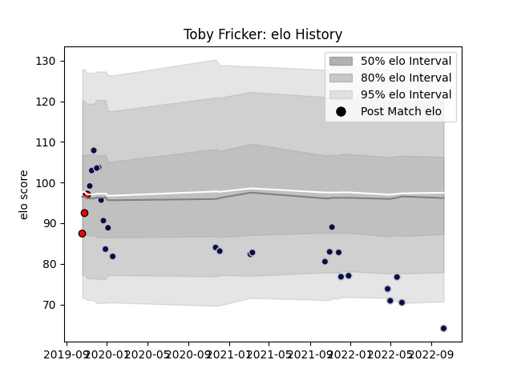

---  
layout: page  
title: Toby Fricker  
date: 2023-01-06 11:44:14.228769  
categories: player  
---
# Toby Fricker

## Positions: W

## Current elo: 64.0

## Current Percentile: 5.0

# Elo History

# Match History

| Team             |   Appearances |   Win Rate |
|:-----------------|--------------:|-----------:|
| Bristol Rugby    |            25 |   0.52     |
| Hartpury College |             3 |   0.333333 |

| Opponent             |   Matches |   Win Rate |
|:---------------------|----------:|-----------:|
| Exeter Chiefs        |         3 |   0.666667 |
| Leicester Tigers     |         3 |   0        |
| Wasps                |         3 |   0.333333 |
| Gloucester Rugby     |         2 |   0.5      |
| London Irish         |         2 |   0.75     |
| Newcastle Falcons    |         2 |   0        |
| Northampton Saints   |         2 |   0.5      |
| Stade Francais Paris |         2 |   1        |
| Worcester Warriors   |         2 |   1        |
| Zebre                |         2 |   0.75     |
| Ampthill             |         1 |   0        |
| Brive                |         1 |   1        |
| Nottingham           |         1 |   1        |
| Sale Sharks          |         1 |   0        |
| Saracens             |         1 |   0        |