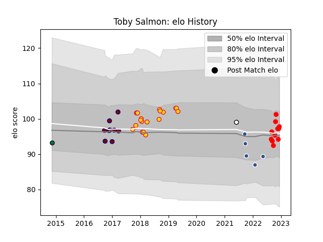

---  
layout: page  
title: Toby Salmon  
date: 2022-12-14 11:14:05.727410  
categories: player  
---
# Toby Salmon

## Positions: L

## Current elo: 98.0

## Current Percentile: 57.0

# Elo History

# Match History

| Team              |   Appearances |   Win Rate |
|:------------------|--------------:|-----------:|
| Exeter Chiefs     |            19 |   0.631579 |
| Rouen             |            11 |   0.636364 |
| Rotherham Titans  |             9 |   0.388889 |
| Agen              |             5 |   0        |
| London Irish      |             1 |   0        |
| Newcastle Falcons |             1 |   0        |

| Opponent            |   Matches |   Win Rate |
|:--------------------|----------:|-----------:|
| Wasps               |         4 |       0.5  |
| Richmond            |         2 |       1    |
| Beziers             |         2 |       0    |
| Worcester Warriors  |         2 |       0    |
| Nottingham          |         2 |       0.25 |
| Colomiers           |         2 |       0.5  |
| Mont-de-Marsan      |         2 |       0.5  |
| Newcastle Falcons   |         2 |       0.5  |
| Jersey              |         2 |       0.5  |
| Leicester Tigers    |         2 |       1    |
| Saracens            |         2 |       0.5  |
| Agen                |         1 |       0    |
| Provence Rugby      |         1 |       0    |
| Scarlets            |         1 |       1    |
| Sale Sharks         |         1 |       1    |
| Soyaux-Angouleme    |         1 |       1    |
| US Bressane         |         1 |       0    |
| Vannes              |         1 |       1    |
| Northampton Saints  |         1 |       1    |
| Montauban           |         1 |       1    |
| Narbonne            |         1 |       0    |
| Montpellier Herault |         1 |       1    |
| Bath Rugby          |         1 |       1    |
| Massy               |         1 |       1    |
| London Scottish     |         1 |       0    |
| London Irish        |         1 |       0    |
| Harlequins          |         1 |       1    |
| Glasgow Warriors    |         1 |       0    |
| Exeter Chiefs       |         1 |       0    |
| Castres Olympique   |         1 |       0    |
| Carcassonne         |         1 |       0    |
| Biarritz Olympique  |         1 |       1    |
| Yorkshire Carnegie  |         1 |       0    |