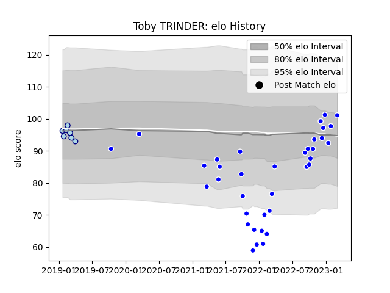

---  
layout: page  
title: Toby TRINDER  
date: 2023-03-09 10:07:52.190265  
categories: player  
---
# Toby TRINDER

## Positions: P

## Current elo: 101.0

## Current Percentile: 60.0

# Elo History

# Match History

| Team     |   Appearances |   Win Rate |
|:---------|--------------:|-----------:|
| Coventry |            36 |   0.597222 |
| Bedford  |             7 |   0.285714 |

| Opponent            |   Matches |   Win Rate |
|:--------------------|----------:|-----------:|
| Doncaster           |         5 |   0.6      |
| Ealing Trailfinders |         5 |   0.2      |
| Jersey              |         5 |   0.3      |
| London Scottish     |         5 |   0.8      |
| Bedford             |         4 |   1        |
| Richmond            |         4 |   1        |
| Cornish Pirates     |         3 |   0.333333 |
| Hartpury College    |         3 |   0.333333 |
| Ampthill            |         2 |   0.5      |
| Nottingham          |         2 |   0.5      |
| Caldy               |         1 |   1        |
| Coventry            |         1 |   1        |
| London Irish        |         1 |   0        |
| Saracens            |         1 |   0        |
| Yorkshire Carnegie  |         1 |   0        |