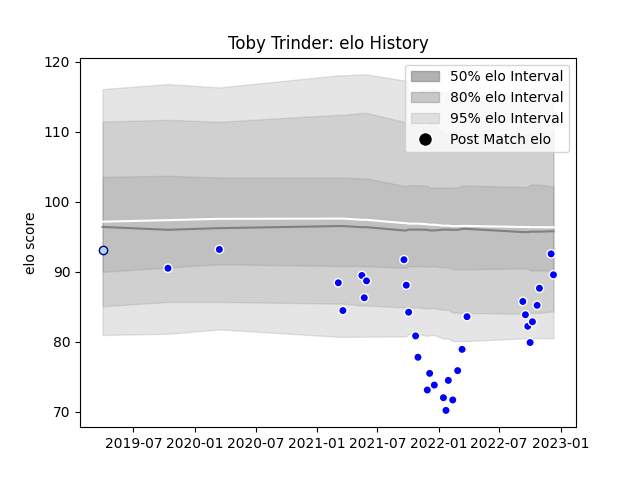

---  
layout: page  
title: Toby Trinder  
date: 2022-12-14 11:17:41.613355  
categories: player  
---
# Toby Trinder

## Positions: P

## Current elo: 90.0

## Current Percentile: 34.0

# Elo History

# Match History

| Team     |   Appearances |   Win Rate |
|:---------|--------------:|-----------:|
| Coventry |            31 |   0.548387 |
| Bedford  |             1 |   0        |

| Opponent            |   Matches |   Win Rate |
|:--------------------|----------:|-----------:|
| Bedford             |         4 |   1        |
| Doncaster           |         4 |   0.75     |
| Ealing Trailfinders |         4 |   0        |
| Cornish Pirates     |         3 |   0.333333 |
| Hartpury College    |         3 |   0.333333 |
| Jersey              |         3 |   0.333333 |
| London Scottish     |         3 |   0.666667 |
| Richmond            |         3 |   1        |
| Ampthill            |         2 |   0.5      |
| Caldy               |         1 |   1        |
| Nottingham          |         1 |   0        |
| Saracens            |         1 |   0        |