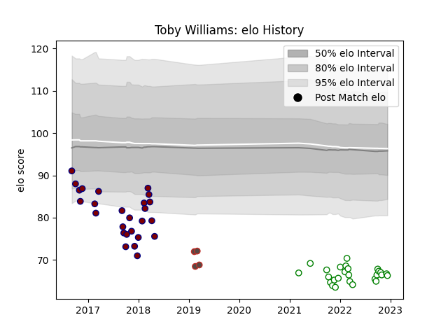

---  
layout: page  
title: Toby Williams  
date: 2023-02-02 18:43:01.230971  
categories: player  
---
# Toby Williams

## Positions: P

## Country: Germany

## Current elo: 85.0

## Current Percentile: 2.0

# Elo History

# Match History

| Team             |   Appearances |   Win Rate |
|:-----------------|--------------:|-----------:|
| Nottingham       |            37 |   0.27027  |
| Rotherham Titans |            37 |   0.162162 |
| Doncaster        |             7 |   0.571429 |
| Germany          |             6 |   0        |

| Opponent            |   Matches |   Win Rate |
|:--------------------|----------:|-----------:|
| Jersey              |         9 |   0.111111 |
| Ealing Trailfinders |         9 |   0        |
| Richmond            |         9 |   0.555556 |
| Cornish Pirates     |         9 |   0.222222 |
| Doncaster           |         8 |   0.125    |
| London Scottish     |         7 |   0.428571 |
| Bedford             |         7 |   0        |
| Hartpury College    |         7 |   0.428571 |
| Yorkshire Carnegie  |         3 |   0        |
| Coventry            |         3 |   0.666667 |
| Caldy               |         2 |   0.5      |
| Bristol Rugby       |         2 |   0        |
| Nottingham          |         2 |   0        |
| Ampthill            |         2 |   0.5      |
| Georgia             |         1 |   0        |
| London Welsh        |         1 |   1        |
| Portugal            |         1 |   0        |
| Belgium             |         1 |   0        |
| Romania             |         1 |   0        |
| Russia              |         1 |   0        |
| Saracens            |         1 |   0        |
| Spain               |         1 |   0        |