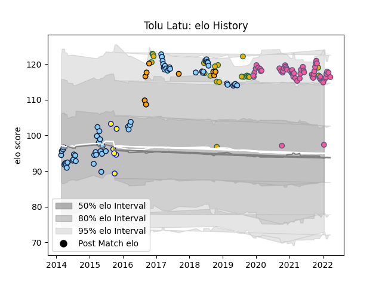

---  
layout: page  
title: Tolu Latu  
date: 2023-03-17 17:17:31.670869  
categories: player  
---
# Tolu Latu

## Positions: H

## Country: Australia

## Current elo: 97.0

## Current Percentile: 90.0

# Elo History

# Match History

| Team                     |   Appearances |   Win Rate |
|:-------------------------|--------------:|-----------:|
| New South Wales Waratahs |            63 |   0.52381  |
| Stade Francais Paris     |            53 |   0.462264 |
| Australia                |            23 |   0.391304 |
| NSW Country Eagles       |             9 |   0.666667 |
| Sydney Stars             |             6 |   0.333333 |

| Opponent            |   Matches |   Win Rate |
|:--------------------|----------:|-----------:|
| Brumbies            |         9 |   0.444444 |
| Queensland Reds     |         7 |   1        |
| Melbourne Rebels    |         7 |   0.857143 |
| Highlanders         |         7 |   0.428571 |
| Western Force       |         5 |   0.4      |
| Stade Toulousain    |         5 |   0.8      |
| New Zealand         |         5 |   0.2      |
| Hurricanes          |         5 |   0.4      |
| England             |         4 |   0        |
| Wales               |         4 |   0.25     |
| Toulon              |         4 |   0.25     |
| Sharks              |         4 |   0.25     |
| Racing 92           |         4 |   0.25     |
| Lyon                |         4 |   0.5      |
| La Rochelle         |         4 |   0.75     |
| Ireland             |         4 |   0.25     |
| Castres Olympique   |         4 |   0.75     |
| Bordeaux Begles     |         4 |   0.25     |
| Clermont Auvergne   |         4 |   0.25     |
| Crusaders           |         3 |   0.666667 |
| Bayonne             |         3 |   0.333333 |
| Blues               |         3 |   0.333333 |
| Brisbane City       |         3 |   0.333333 |
| Bristol Rugby       |         3 |   0        |
| Melbourne Rising    |         3 |   0.666667 |
| Lions               |         3 |   0        |
| Brive               |         3 |   0.333333 |
| Greater Sydney Rams |         2 |   0.5      |
| Pau                 |         2 |   0.5      |
| Biarritz Olympique  |         2 |   0.5      |
| Sunwolves           |         2 |   1        |
| Stormers            |         2 |   0.5      |
| Fijian Drua         |         2 |   0.5      |
| Argentina           |         2 |   1        |
| Agen                |         2 |   1        |
| North Harbour Rays  |         2 |   1        |
| Connacht            |         2 |   0.5      |
| Montpellier Herault |         2 |   0.25     |
| Chiefs              |         2 |   0        |
| Canberra Vikings    |         2 |   0.5      |
| Perpignan           |         1 |   1        |
| Queensland Country  |         1 |   0        |
| Georgia             |         1 |   1        |
| Scotland            |         1 |   1        |
| France              |         1 |   1        |
| Southern Kings      |         1 |   0        |
| Bulls               |         1 |   1        |
| Sydney Rays         |         1 |   1        |
| Fiji                |         1 |   1        |
| Jaguares            |         1 |   0        |