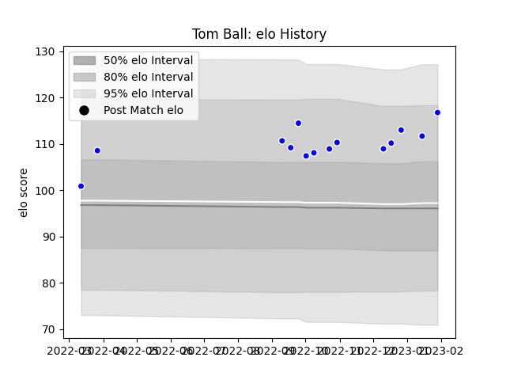

---  
layout: page  
title: Tom Ball  
date: 2022-12-18 16:39:34.214457  
categories: player  
---
# Tom Ball

## Positions: FL

## Current elo: 100.0

## Current Percentile: 59.0

# Elo History

# Match History

| Team     |   Appearances |   Win Rate |
|:---------|--------------:|-----------:|
| Coventry |            10 |        0.7 |

| Opponent            |   Matches |   Win Rate |
|:--------------------|----------:|-----------:|
| Bedford             |         2 |          1 |
| Ampthill            |         1 |          1 |
| Caldy               |         1 |          1 |
| Cornish Pirates     |         1 |          1 |
| Ealing Trailfinders |         1 |          0 |
| Hartpury College    |         1 |          0 |
| Jersey              |         1 |          0 |
| London Scottish     |         1 |          1 |
| Richmond            |         1 |          1 |