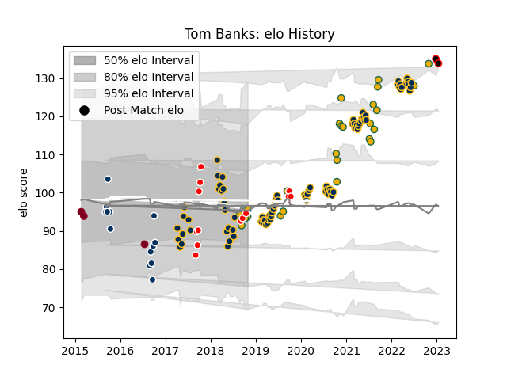

---  
layout: page  
title: Tom Banks  
date: 2022-12-28 12:55:34.187315  
categories: player  
---
# Tom Banks

## Positions: FB

## Country: Australia

## Current elo: 95.0

## Current Percentile: 49.0

# Elo History

# Match History

| Team               |   Appearances |   Win Rate |
|:-------------------|--------------:|-----------:|
| Brumbies           |            85 |   0.588235 |
| Australia          |            25 |   0.52     |
| Canberra Vikings   |            14 |   0.714286 |
| Queensland Country |            13 |   0.230769 |
| Queensland Reds    |             3 |   0.333333 |
| Mie Honda Heat     |             1 |   1        |

| Opponent                 |   Matches |   Win Rate |
|:-------------------------|----------:|-----------:|
| Queensland Reds          |        14 |   0.5      |
| Melbourne Rebels         |        12 |   0.416667 |
| New Zealand              |        11 |   0.227273 |
| Western Force            |        10 |   0.9      |
| New South Wales Waratahs |        10 |   0.9      |
| Hurricanes               |         6 |   0.666667 |
| Sunwolves                |         5 |   1        |
| Chiefs                   |         5 |   0.6      |
| Blues                    |         5 |   0.2      |
| South Africa             |         4 |   0.75     |
| NSW Country Eagles       |         4 |   0.75     |
| Jaguares                 |         4 |   0.25     |
| Argentina                |         4 |   0.625    |
| Brisbane City            |         4 |   0.25     |
| Crusaders                |         4 |   0        |
| Highlanders              |         3 |   0        |
| Fijian Drua              |         3 |   1        |
| Perth Spirit             |         3 |   0.333333 |
| France                   |         3 |   0.666667 |
| Lions                    |         3 |   0.333333 |
| Queensland Country       |         2 |   0.5      |
| Sydney Rays              |         2 |   1        |
| Sharks                   |         2 |   1        |
| Bulls                    |         2 |   1        |
| Melbourne Rising         |         2 |   0.5      |
| Greater Sydney Rams      |         2 |   0.5      |
| North Harbour Rays       |         2 |   0        |
| Canberra Vikings         |         2 |   0        |
| Moana Pasifika           |         1 |   0        |
| Scotland                 |         1 |   1        |
| Brumbies                 |         1 |   0        |
| Southern Kings           |         1 |   1        |
| Stormers                 |         1 |   1        |
| Kamaishi Seawaves        |         1 |   1        |
| England                  |         1 |   1        |
| Samoa                    |         1 |   1        |