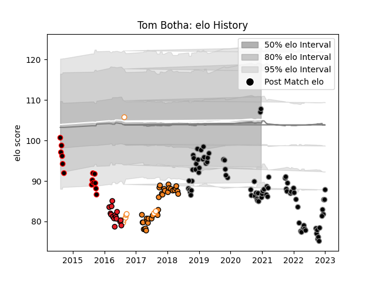

---  
layout: page  
title: Tom Botha  
date: 2023-02-02 18:46:01.676041  
categories: player  
---
# Tom Botha

## Positions: P

## Current elo: 101.0

## Current Percentile: 16.0

# Elo History

# Match History

| Team                   |   Appearances |   Win Rate |
|:-----------------------|--------------:|-----------:|
| Ospreys                |            85 |   0.511765 |
| Cheetahs               |            33 |   0.454545 |
| Southern Kings         |            15 |   0.133333 |
| Eastern Province Kings |            14 |   0.142857 |
| Free State Cheetahs    |             8 |   1        |

| Opponent               |   Matches |   Win Rate |
|:-----------------------|----------:|-----------:|
| Cardiff Blues          |         9 |   0.777778 |
| Scarlets               |         9 |   0.5      |
| Dragons                |         9 |   0.611111 |
| Zebre                  |         8 |   0.875    |
| Connacht               |         8 |   0.375    |
| Glasgow Warriors       |         7 |   0.285714 |
| Munster                |         7 |   0.142857 |
| Ulster                 |         6 |   0.166667 |
| Southern Kings         |         6 |   0.833333 |
| Leinster               |         6 |   0.333333 |
| Stormers               |         5 |   0.1      |
| Sharks                 |         5 |   0        |
| Benetton Treviso       |         5 |   0.8      |
| Edinburgh              |         4 |   1        |
| Lions                  |         4 |   0        |
| Western Province       |         4 |   0.5      |
| Golden Lions           |         4 |   0.25     |
| Bulls                  |         4 |   0        |
| Blue Bulls             |         4 |   0.5      |
| Sunwolves              |         3 |   1        |
| Cheetahs               |         3 |   0.666667 |
| Natal Sharks           |         3 |   0.333333 |
| Jaguares               |         3 |   0.333333 |
| Crusaders              |         2 |   0        |
| Chiefs                 |         2 |   0        |
| Leicester Tigers       |         2 |   0.5      |
| Free State Cheetahs    |         2 |   0.5      |
| Worcester Warriors     |         2 |   0.5      |
| Pumas                  |         2 |   0        |
| Hurricanes             |         2 |   0        |
| Montpellier Herault    |         2 |   1        |
| Highlanders            |         2 |   0        |
| Stade Francais Paris   |         2 |   0.5      |
| Blues                  |         2 |   0        |
| Griquas                |         1 |   1        |
| Eastern Province Kings |         1 |   1        |
| Castres Olympique      |         1 |   1        |
| Boland Cavaliers       |         1 |   1        |
| Saracens               |         1 |   0        |
| Pau                    |         1 |   1        |
| Ospreys                |         1 |   1        |