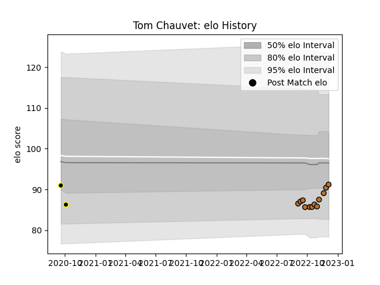

---  
layout: page  
title: Tom Chauvet  
date: 2023-02-02 19:01:01.577418  
categories: player  
---
# Tom Chauvet

## Positions: FH

## Current elo: 93.0

## Current Percentile: 61.0

# Elo History

# Match History

| Team           |   Appearances |   Win Rate |
|:---------------|--------------:|-----------:|
| Narbonne       |            16 |    0.59375 |
| Mont-de-Marsan |             2 |    0       |

| Opponent                   |   Matches |   Win Rate |
|:---------------------------|----------:|-----------:|
| Albi                       |         2 |        0   |
| Bourgoin-Jallieu           |         2 |        0.5 |
| Nice                       |         2 |        1   |
| Suresnes                   |         2 |        1   |
| Blagnac                    |         1 |        0.5 |
| Carqueiranne-Hyères        |         1 |        1   |
| Chambery                   |         1 |        0   |
| Cognac Saint Jean d'Angély |         1 |        1   |
| Perpignan                  |         1 |        0   |
| Rennes                     |         1 |        1   |
| Tarbes                     |         1 |        0   |
| US Bressane                |         1 |        1   |
| Valence Romans Drome Rugby |         1 |        0   |
| Vannes                     |         1 |        0   |