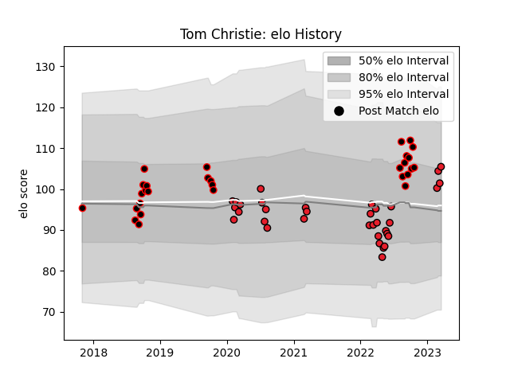

---  
layout: page  
title: Tom Christie  
date: 2023-03-16 19:54:19.329529  
categories: player  
---
# Tom Christie

## Positions: FL

## Current elo: 102.0

## Current Percentile: 75.0

# Elo History

# Match History

| Team       |   Appearances |   Win Rate |
|:-----------|--------------:|-----------:|
| Crusaders  |            33 |   0.787879 |
| Canterbury |            29 |   0.758621 |

| Opponent                 |   Matches |   Win Rate |
|:-------------------------|----------:|-----------:|
| Highlanders              |         7 |   1        |
| Chiefs                   |         7 |   0.571429 |
| Blues                    |         4 |   0.75     |
| Wellington               |         4 |   0.5      |
| Hurricanes               |         4 |   0.75     |
| Manawatu                 |         3 |   0.666667 |
| Otago                    |         3 |   1        |
| Northland                |         3 |   1        |
| North Harbour            |         3 |   1        |
| Tasman                   |         3 |   0.666667 |
| Auckland                 |         3 |   0.333333 |
| Queensland Reds          |         3 |   1        |
| Taranaki                 |         2 |   0.5      |
| New South Wales Waratahs |         2 |   0.5      |
| Hawke's Bay              |         2 |   1        |
| Fijian Drua              |         2 |   0.5      |
| Counties Manukau         |         2 |   1        |
| Moana Pasifika           |         1 |   1        |
| Sunwolves                |         1 |   1        |
| Bay of Plenty            |         1 |   1        |
| Brumbies                 |         1 |   1        |
| Western Force            |         1 |   1        |