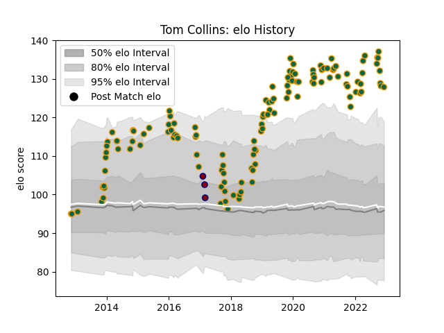

---  
layout: page  
title: Tom Collins  
date: 2023-01-06 11:42:48.611351  
categories: player  
---
# Tom Collins

## Positions: W

## Current elo: 115.0

## Current Percentile: 87.0

# Elo History

# Match History

| Team               |   Appearances |   Win Rate |
|:-------------------|--------------:|-----------:|
| Northampton Saints |           129 |    0.53876 |
| Rotherham Titans   |             3 |    0       |

| Opponent            |   Matches |   Win Rate |
|:--------------------|----------:|-----------:|
| Leicester Tigers    |        13 |   0.461538 |
| Worcester Warriors  |        12 |   0.916667 |
| London Irish        |        11 |   0.818182 |
| Wasps               |        10 |   0.4      |
| Harlequins          |        10 |   0.5      |
| Bath Rugby          |         9 |   0.388889 |
| Saracens            |         9 |   0.333333 |
| Exeter Chiefs       |         9 |   0.333333 |
| Sale Sharks         |         8 |   0.375    |
| Newcastle Falcons   |         8 |   0.75     |
| Gloucester Rugby    |         8 |   0.5      |
| Bristol Rugby       |         6 |   0.5      |
| Leinster            |         4 |   0.25     |
| Clermont Auvergne   |         4 |   0        |
| Dragons             |         2 |   1        |
| Benetton Treviso    |         1 |   1        |
| Lyon                |         1 |   1        |
| Glasgow Warriors    |         1 |   1        |
| Ospreys             |         1 |   1        |
| Ealing Trailfinders |         1 |   0        |
| Scarlets            |         1 |   1        |
| Timisoara Saracens  |         1 |   1        |
| Cornish Pirates     |         1 |   0        |
| Yorkshire Carnegie  |         1 |   0        |