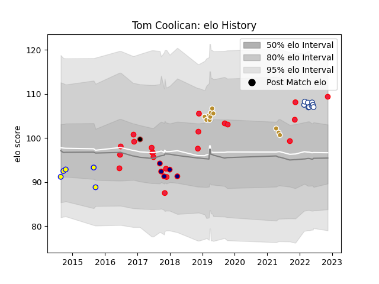

---  
layout: page  
title: Tom Coolican  
date: 2022-11-15 23:37:39.568027  
categories: player  
---
# Tom Coolican

## Positions: FL, L

## Country: Canada

## Current elo: 110.0

## Current Percentile: 83.0

# Elo History

# Match History

| Team            |   Appearances |   Win Rate |
|:----------------|--------------:|-----------:|
| Canada          |            21 |   0.357143 |
| NOLA Gold       |            11 |   0.636364 |
| London Scottish |             5 |   0.2      |
| Sydney Stars    |             5 |   0.5      |
| Saracens        |             1 |   1        |
| Toronto Arrows  |             1 |   0        |

| Opponent                 |   Matches |   Win Rate |
|:-------------------------|----------:|-----------:|
| United States of America |         4 |      0.125 |
| Austin Elite Rugby       |         2 |      1     |
| Toronto Arrows           |         2 |      1     |
| Canberra Vikings         |         2 |      0.25  |
| Seattle Seawolves        |         2 |      0     |
| Houston SaberCats        |         2 |      1     |
| Romania                  |         2 |      0     |
| Queensland Country       |         1 |      1     |
| North Harbour Rays       |         1 |      1     |
| Nottingham               |         1 |      1     |
| Portugal                 |         1 |      0     |
| Russia                   |         1 |      1     |
| R.U. New York            |         1 |      0     |
| Netherlands              |         1 |      1     |
| Scarlets                 |         1 |      1     |
| South Africa             |         1 |      0     |
| Spain                    |         1 |      1     |
| New Zealand Maori        |         1 |      0     |
| Japan                    |         1 |      0     |
| Kenya                    |         1 |      1     |
| Austin Gilgronis         |         1 |      0     |
| Italy                    |         1 |      0     |
| Ireland                  |         1 |      0     |
| Hong Kong                |         1 |      1     |
| Hartpury College         |         1 |      0     |
| Glendale Raptors         |         1 |      0     |
| Germany                  |         1 |      1     |
| Georgia                  |         1 |      0     |
| Fiji                     |         1 |      0     |
| Ealing Trailfinders      |         1 |      0     |
| Cornish Pirates          |         1 |      0     |
| Brisbane City            |         1 |      0     |
| Belgium                  |         1 |      1     |
| Bedford                  |         1 |      0     |
| Utah Warriors            |         1 |      1     |