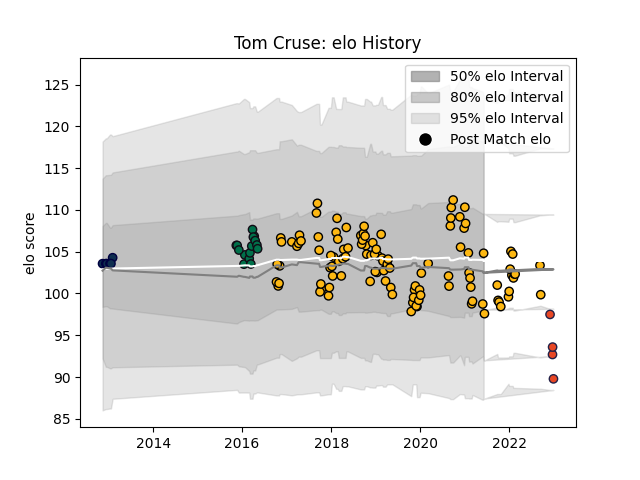

---  
layout: page  
title: Tom Cruse  
date: 2022-12-12 14:51:19.359530  
categories: player  
---
# Tom Cruse

## Positions: H

## Current elo: 87.0

## Current Percentile: 21.0

# Elo History

# Match History

| Team         |   Appearances |   Win Rate |
|:-------------|--------------:|-----------:|
| Wasps        |           108 |   0.490741 |
| London Irish |            15 |   0.2      |
| Sale Sharks  |             6 |   0.166667 |
| Edinburgh    |             1 |   0        |

| Opponent            |   Matches |   Win Rate |
|:--------------------|----------:|-----------:|
| Harlequins          |        13 |   0.230769 |
| Bath Rugby          |        10 |   0.45     |
| Sale Sharks         |        10 |   0.3      |
| Gloucester Rugby    |        10 |   0.35     |
| Worcester Warriors  |         9 |   0.888889 |
| Saracens            |         9 |   0.222222 |
| Bristol Rugby       |         8 |   0.875    |
| Exeter Chiefs       |         8 |   0.5625   |
| Northampton Saints  |         8 |   0.5      |
| Leicester Tigers    |         8 |   0.375    |
| Newcastle Falcons   |         6 |   0.5      |
| London Irish        |         5 |   0.4      |
| Agen                |         4 |   1        |
| Stade Toulousain    |         3 |   0.5      |
| Leinster            |         2 |   0        |
| Munster             |         2 |   0        |
| La Rochelle         |         2 |   0.5      |
| Grenoble            |         2 |   0        |
| Toulon              |         2 |   0        |
| Ulster              |         2 |   0.5      |
| Wasps               |         2 |   0.5      |
| Montpellier Herault |         1 |   0        |
| Edinburgh           |         1 |   0        |
| Cardiff Blues       |         1 |   0        |
| Bordeaux Begles     |         1 |   0        |
| Zebre               |         1 |   1        |