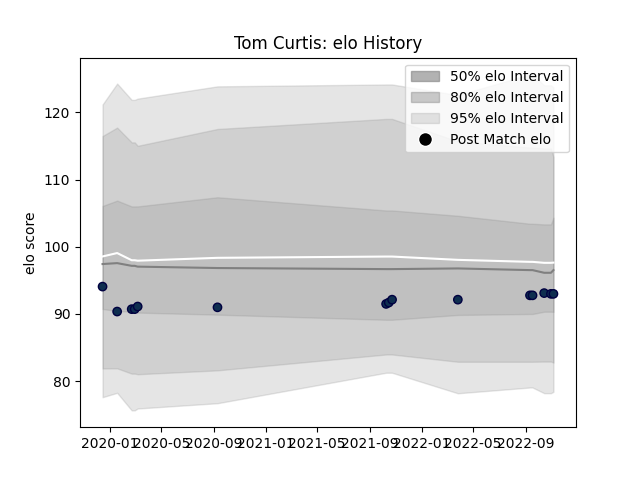

---  
layout: page  
title: Tom Curtis  
date: 2022-12-14 11:12:00.684217  
categories: player  
---
# Tom Curtis

## Positions: FH

## Current elo: 93.0

## Current Percentile: None

# Elo History

# Match History

| Team        |   Appearances |   Win Rate |
|:------------|--------------:|-----------:|
| Sale Sharks |            15 |   0.633333 |

| Opponent           |   Matches |   Win Rate |
|:-------------------|----------:|-----------:|
| Gloucester Rugby   |         3 |   0.666667 |
| Bath Rugby         |         2 |   0.75     |
| Leicester Tigers   |         2 |   0.5      |
| London Irish       |         2 |   1        |
| Saracens           |         2 |   0.5      |
| Exeter Chiefs      |         1 |   0        |
| Glasgow Warriors   |         1 |   0        |
| Harlequins         |         1 |   1        |
| Northampton Saints |         1 |   1        |