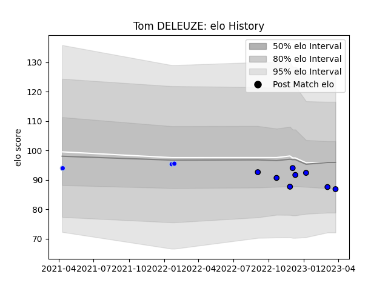

---  
layout: page  
title: Tom DELEUZE  
date: 2023-03-11 00:11:04.695057  
categories: player  
---
# Tom DELEUZE

## Positions: FH

## Current elo: 89.0

## Current Percentile: 46.0

# Elo History

# Match History

| Team      |   Appearances |   Win Rate |
|:----------|--------------:|-----------:|
| Massy     |             7 |   0.142857 |
| Colomiers |             3 |   0.333333 |

| Opponent           |   Matches |   Win Rate |
|:-------------------|----------:|-----------:|
| Vannes             |         3 |   0.333333 |
| Oyonnax            |         2 |   0.5      |
| Agen               |         1 |   0        |
| Biarritz Olympique |         1 |   0        |
| Colomiers          |         1 |   0        |
| Provence Rugby     |         1 |   0        |
| Soyaux-Angouleme   |         1 |   0        |