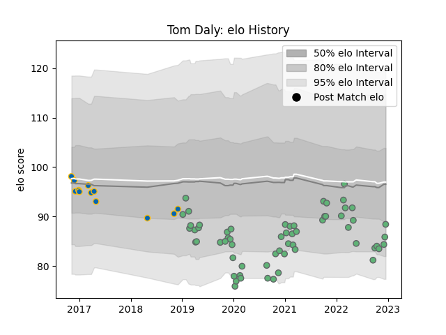

---  
layout: page  
title: Tom Daly  
date: 2023-01-06 00:13:04.900005  
categories: player  
---
# Tom Daly

## Positions: C

## Current elo: 95.0

## Current Percentile: 23.0

# Elo History

# Match History

| Team     |   Appearances |   Win Rate |
|:---------|--------------:|-----------:|
| Connacht |            62 |   0.435484 |
| Leinster |            12 |   0.75     |

| Opponent            |   Matches |   Win Rate |
|:--------------------|----------:|-----------:|
| Ulster              |         8 |   0.375    |
| Munster             |         8 |   0        |
| Cardiff Blues       |         7 |   0.571429 |
| Scarlets            |         6 |   0.333333 |
| Leinster            |         5 |   0.2      |
| Zebre               |         4 |   1        |
| Ospreys             |         4 |   0.75     |
| Dragons             |         4 |   0.75     |
| Edinburgh           |         4 |   0.25     |
| Benetton Treviso    |         3 |   1        |
| Gloucester Rugby    |         2 |   0.5      |
| Glasgow Warriors    |         2 |   0.5      |
| Connacht            |         2 |   0.5      |
| Southern Kings      |         2 |   1        |
| Stade Toulousain    |         2 |   0        |
| Bulls               |         2 |   0.5      |
| Montpellier Herault |         2 |   0.5      |
| Lions               |         1 |   1        |
| Brive               |         1 |   1        |
| Newcastle Falcons   |         1 |   1        |
| Sale Sharks         |         1 |   0        |
| Cheetahs            |         1 |   1        |
| Sharks              |         1 |   0        |
| Stormers            |         1 |   1        |