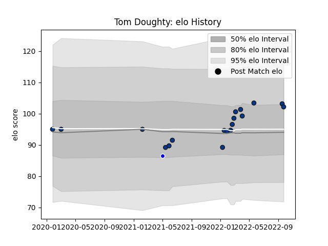

---  
layout: page  
title: Tom Doughty  
date: 2023-03-17 17:24:16.717662  
categories: player  
---
# Tom Doughty

## Positions: H

## Current elo: 101.0

## Current Percentile: 73.0

# Elo History

# Match History

| Team       |   Appearances |   Win Rate |
|:-----------|--------------:|-----------:|
| Bath Rugby |            19 |   0.394737 |
| Coventry   |             1 |   0        |

| Opponent           |   Matches |   Win Rate |
|:-------------------|----------:|-----------:|
| Harlequins         |         3 |   0.333333 |
| Sale Sharks        |         3 |   0.166667 |
| Bristol Rugby      |         2 |   0.5      |
| Leicester Tigers   |         2 |   0.5      |
| Wasps              |         2 |   0        |
| Cornish Pirates    |         1 |   0        |
| Exeter Chiefs      |         1 |   0        |
| La Rochelle        |         1 |   0        |
| London Irish       |         1 |   1        |
| Newcastle Falcons  |         1 |   1        |
| Northampton Saints |         1 |   1        |
| Toulon             |         1 |   0        |
| Worcester Warriors |         1 |   1        |