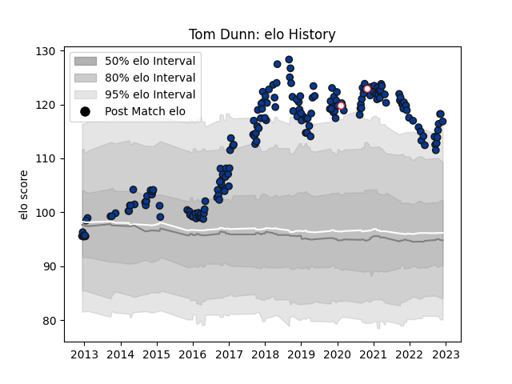

---  
layout: page  
title: Tom Dunn  
date: 2022-12-18 16:15:48.386144  
categories: player  
---
# Tom Dunn

## Positions: H

## Country: England

## Current elo: 114.0

## Current Percentile: 94.0

# Elo History

# Match History

| Team       |   Appearances |   Win Rate |
|:-----------|--------------:|-----------:|
| Bath Rugby |           180 |      0.475 |
| England    |             2 |      1     |

| Opponent           |   Matches |   Win Rate |
|:-------------------|----------:|-----------:|
| Northampton Saints |        16 |   0.5      |
| Exeter Chiefs      |        16 |   0.15625  |
| Gloucester Rugby   |        15 |   0.5      |
| Harlequins         |        14 |   0.5      |
| Saracens           |        13 |   0.269231 |
| Sale Sharks        |        13 |   0.538462 |
| Wasps              |        12 |   0.25     |
| Leicester Tigers   |        12 |   0.583333 |
| London Irish       |        11 |   0.818182 |
| Newcastle Falcons  |        11 |   0.545455 |
| Worcester Warriors |        10 |   0.8      |
| Bristol Rugby      |        10 |   0.4      |
| Toulon             |         4 |   0.25     |
| Scarlets           |         3 |   0.333333 |
| Stade Toulousain   |         2 |   0        |
| Leinster           |         2 |   0        |
| Benetton Treviso   |         2 |   1        |
| London Welsh       |         2 |   1        |
| Clermont Auvergne  |         2 |   0        |
| Calvisano          |         2 |   1        |
| Pau                |         2 |   1        |
| Italy              |         1 |   1        |
| Ulster             |         1 |   0        |
| Bucuresti          |         1 |   1        |
| Scotland           |         1 |   1        |
| Brive              |         1 |   1        |
| Glasgow Warriors   |         1 |   0        |
| Ospreys            |         1 |   0        |
| Agen               |         1 |   1        |