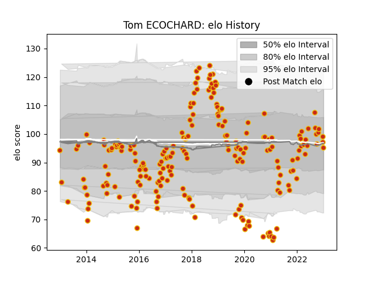

---  
layout: page  
title: Tom ECOCHARD  
date: 2023-01-17 11:31:36.972473  
categories: player  
---
# Tom ECOCHARD

## Positions: SH

## Current elo: 95.0

## Current Percentile: 57.0

# Elo History

# Match History

| Team      |   Appearances |   Win Rate |
|:----------|--------------:|-----------:|
| Perpignan |           211 |   0.495261 |

| Opponent                   |   Matches |   Win Rate |
|:---------------------------|----------:|-----------:|
| Biarritz Olympique         |        12 |   0.666667 |
| Carcassonne                |        10 |   0.7      |
| Colomiers                  |        10 |   0.45     |
| Mont-de-Marsan             |        10 |   0.6      |
| Beziers                    |        10 |   0.6      |
| Aurillac                   |         9 |   0.611111 |
| Dax                        |         8 |   0.5      |
| Montauban                  |         8 |   0.75     |
| Grenoble                   |         8 |   0.625    |
| Narbonne                   |         7 |   0.714286 |
| Lyon                       |         7 |   0.285714 |
| Agen                       |         7 |   0.428571 |
| Racing 92                  |         6 |   0.25     |
| Soyaux-Angouleme           |         6 |   0.916667 |
| Toulon                     |         6 |   0.166667 |
| Bayonne                    |         6 |   0.666667 |
| La Rochelle                |         5 |   0.2      |
| Montpellier Herault        |         5 |   0.2      |
| Albi                       |         5 |   0.4      |
| Vannes                     |         5 |   0.8      |
| Bordeaux Begles            |         5 |   0.3      |
| Castres Olympique          |         5 |   0.4      |
| Massy                      |         4 |   0.75     |
| Clermont Auvergne          |         4 |   0        |
| Stade Toulousain           |         4 |   0.25     |
| Rouen                      |         4 |   0.5      |
| Pau                        |         4 |   0.25     |
| Provence Rugby             |         3 |   0.333333 |
| Tarbes                     |         3 |   0.333333 |
| Bourgoin-Jallieu           |         3 |   0.666667 |
| Brive                      |         3 |   0.333333 |
| Oyonnax                    |         3 |   0.666667 |
| Nevers                     |         3 |   0.666667 |
| Glasgow Warriors           |         2 |   0        |
| Stade Francais Paris       |         2 |   0        |
| Munster                    |         2 |   0        |
| Connacht                   |         2 |   0        |
| Roval Drome XV             |         1 |   1        |
| Rovigo                     |         1 |   1        |
| Edinburgh                  |         1 |   0        |
| Valence Romans Drome Rugby |         1 |   1        |
| Gloucester Rugby           |         1 |   0        |