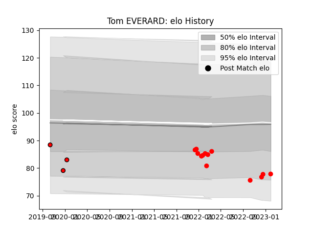

---  
layout: page  
title: Tom EVERARD  
date: 2023-03-30 11:31:38.373509  
categories: player  
---
# Tom EVERARD

Last updated: 2023-03-30
## Positions: L

## Current elo: 87.0

## Current Percentile: 7.0

# Elo History

# Match History

| Team             |   Appearances |   Win Rate |
|:-----------------|--------------:|-----------:|
| Jersey           |            14 |   0.785714 |
| Hartpury College |             3 |   0        |

| Opponent            |   Matches |   Win Rate |
|:--------------------|----------:|-----------:|
| Nottingham          |         3 |        1   |
| Caldy               |         2 |        1   |
| Cornish Pirates     |         2 |        0.5 |
| Doncaster           |         2 |        0   |
| Ampthill            |         1 |        1   |
| Bedford             |         1 |        0   |
| Coventry            |         1 |        1   |
| Ealing Trailfinders |         1 |        0   |
| Hartpury College    |         1 |        1   |
| Jersey              |         1 |        0   |
| London Scottish     |         1 |        1   |
| Richmond            |         1 |        1   |