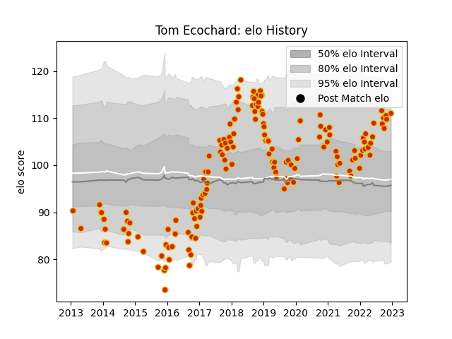

---  
layout: page  
title: Tom Ecochard  
date: 2022-12-18 16:23:02.808558  
categories: player  
---
# Tom Ecochard

## Positions: SH

## Current elo: 111.0

## Current Percentile: 87.0

# Elo History

# Match History

| Team      |   Appearances |   Win Rate |
|:----------|--------------:|-----------:|
| Perpignan |           152 |   0.473684 |

| Opponent             |   Matches |   Win Rate |
|:---------------------|----------:|-----------:|
| Colomiers            |         9 |   0.5      |
| Carcassonne          |         8 |   0.75     |
| Biarritz Olympique   |         8 |   0.75     |
| Lyon                 |         7 |   0.285714 |
| Aurillac             |         7 |   0.642857 |
| Beziers              |         7 |   0.571429 |
| Mont-de-Marsan       |         7 |   0.571429 |
| Narbonne             |         6 |   0.666667 |
| Agen                 |         6 |   0.333333 |
| Bordeaux Begles      |         5 |   0.3      |
| Toulon               |         5 |   0.2      |
| Racing 92            |         5 |   0.3      |
| Bayonne              |         5 |   0.6      |
| Grenoble             |         5 |   0.6      |
| Stade Toulousain     |         4 |   0.25     |
| Soyaux-Angouleme     |         4 |   1        |
| Dax                  |         4 |   0.5      |
| La Rochelle          |         4 |   0.25     |
| Castres Olympique    |         4 |   0.25     |
| Montauban            |         4 |   1        |
| Brive                |         3 |   0.333333 |
| Pau                  |         3 |   0        |
| Montpellier Herault  |         3 |   0.333333 |
| Vannes               |         3 |   0.666667 |
| Clermont Auvergne    |         3 |   0        |
| Albi                 |         2 |   0.5      |
| Bourgoin-Jallieu     |         2 |   1        |
| Stade Francais Paris |         2 |   0        |
| Connacht             |         2 |   0        |
| Rouen                |         2 |   0        |
| Massy                |         2 |   0.5      |
| Nevers               |         2 |   0.5      |
| Munster              |         2 |   0        |
| Provence Rugby       |         1 |   0        |
| Glasgow Warriors     |         1 |   0        |
| Rovigo               |         1 |   1        |
| Oyonnax              |         1 |   1        |
| Gloucester Rugby     |         1 |   0        |
| Tarbes               |         1 |   1        |
| Edinburgh            |         1 |   0        |