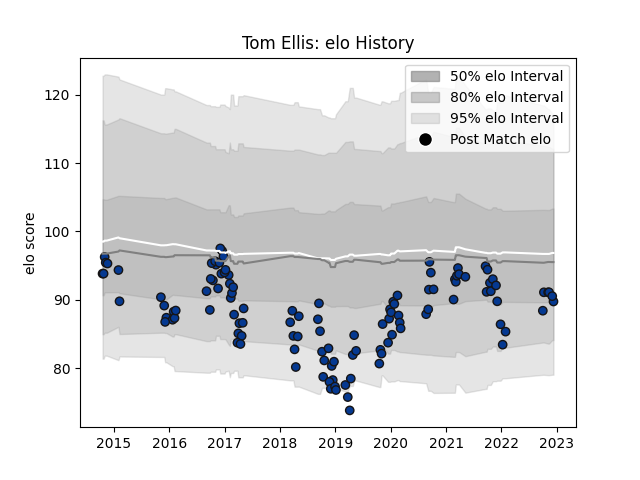

---  
layout: page  
title: Tom Ellis  
date: 2023-02-02 19:13:08.631310  
categories: player  
---
# Tom Ellis

## Positions: FL, L

## Current elo: 74.0

## Current Percentile: 8.0

# Elo History

# Match History

| Team       |   Appearances |   Win Rate |
|:-----------|--------------:|-----------:|
| Bath Rugby |           120 |   0.445833 |
| Saracens   |             1 |   1        |

| Opponent             |   Matches |   Win Rate |
|:---------------------|----------:|-----------:|
| Exeter Chiefs        |        13 |   0.153846 |
| Gloucester Rugby     |        12 |   0.5      |
| Leicester Tigers     |        11 |   0.545455 |
| Harlequins           |        10 |   0.6      |
| Bristol Rugby        |         8 |   0.375    |
| Northampton Saints   |         8 |   0.75     |
| Worcester Warriors   |         8 |   0.75     |
| Newcastle Falcons    |         7 |   0.428571 |
| Sale Sharks          |         7 |   0.5      |
| Wasps                |         7 |   0.5      |
| Saracens             |         6 |   0.333333 |
| London Irish         |         5 |   0.6      |
| Toulon               |         3 |   0        |
| Glasgow Warriors     |         3 |   0.166667 |
| Cardiff Blues        |         2 |   0.5      |
| Stade Toulousain     |         2 |   0        |
| Leinster             |         2 |   0        |
| Ospreys              |         1 |   0        |
| Clermont Auvergne    |         1 |   0        |
| Brive                |         1 |   1        |
| Stade Francais Paris |         1 |   0        |
| London Welsh         |         1 |   1        |
| Ulster               |         1 |   0        |
| Pau                  |         1 |   1        |