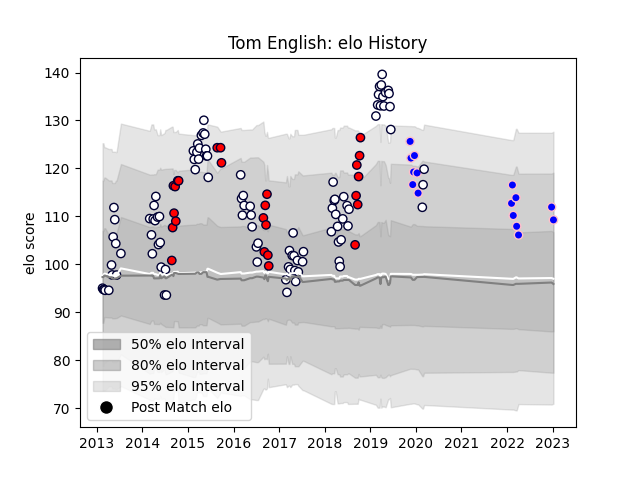

---  
layout: page  
title: Tom English  
date: 2023-01-13 11:37:01.304409  
categories: player  
---
# Tom English

## Positions: W, C

## Current elo: 109.0

## Current Percentile: 82.0

# Elo History

# Match History

| Team              |   Appearances |   Win Rate |
|:------------------|--------------:|-----------:|
| Melbourne Rebels  |           101 |   0.371287 |
| Melbourne Rising  |            25 |   0.6      |
| Kurita Water Gush |            15 |   0.333333 |

| Opponent                         |   Matches |   Win Rate |
|:---------------------------------|----------:|-----------:|
| Brumbies                         |        13 |   0.538462 |
| Queensland Reds                  |        12 |   0.5      |
| New South Wales Waratahs         |        10 |   0.1      |
| Western Force                    |         9 |   0.666667 |
| Highlanders                      |         7 |   0.428571 |
| Crusaders                        |         7 |   0.142857 |
| Sharks                           |         6 |   0.25     |
| Chiefs                           |         6 |   0.166667 |
| Sunwolves                        |         5 |   1        |
| Stormers                         |         5 |   0.2      |
| Hurricanes                       |         5 |   0        |
| Lions                            |         5 |   0.2      |
| Blues                            |         4 |   0.5      |
| Bulls                            |         4 |   0.25     |
| Queensland Country               |         4 |   0.75     |
| NSW Country Eagles               |         3 |   0.666667 |
| Canberra Vikings                 |         3 |   0.666667 |
| Greater Sydney Rams              |         3 |   0.666667 |
| Perth Spirit                     |         3 |   0.333333 |
| Brisbane City                    |         3 |   0.666667 |
| Shimizu Blue Sharks              |         2 |   0.5      |
| Jaguares                         |         2 |   0        |
| Toyota Industries Shuttles Aichi |         2 |   0        |
| North Harbour Rays               |         2 |   0.5      |
| Kyuden Voltex                    |         2 |   0.5      |
| Chugoku Red Regulions            |         2 |   0.5      |
| Munakata Sanix Blues             |         2 |   0        |
| Sydney Stars                     |         1 |   1        |
| Sydney Rays                      |         1 |   1        |
| Fijian Drua                      |         1 |   0        |
| Mazda Blue Zoomers               |         1 |   1        |
| Southern Kings                   |         1 |   0        |
| Skyactivs Hiroshima              |         1 |   1        |
| Cheetahs                         |         1 |   1        |
| Kamaishi Seawaves                |         1 |   0        |
| Coca-Cola Red Sparks             |         1 |   0        |
| Hanazono Kintetsu Liners         |         1 |   0        |