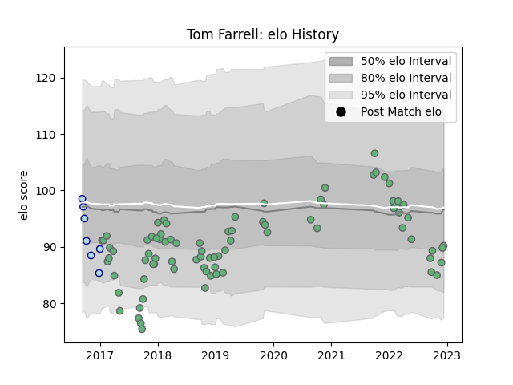

---  
layout: page  
title: Tom Farrell  
date: 2023-01-06 00:17:12.480360  
categories: player  
---
# Tom Farrell

## Positions: C

## Current elo: 103.0

## Current Percentile: 82.0

# Elo History

# Match History

| Team     |   Appearances |   Win Rate |
|:---------|--------------:|-----------:|
| Connacht |            86 |   0.505814 |
| Bedford  |             7 |   0.285714 |

| Opponent             |   Matches |   Win Rate |
|:---------------------|----------:|-----------:|
| Zebre                |         8 |   0.625    |
| Ulster               |         8 |   0.5      |
| Leinster             |         8 |   0.125    |
| Glasgow Warriors     |         6 |   0.166667 |
| Scarlets             |         5 |   0.4      |
| Ospreys              |         5 |   0.8      |
| Benetton Treviso     |         5 |   1        |
| Munster              |         5 |   0.4      |
| Cardiff Blues        |         5 |   0.4      |
| Cheetahs             |         4 |   1        |
| Dragons              |         4 |   0.5      |
| Edinburgh            |         3 |   0.333333 |
| Jersey               |         2 |   0.5      |
| Brive                |         2 |   1        |
| Stormers             |         2 |   0.5      |
| Stade Toulousain     |         2 |   0        |
| Southern Kings       |         2 |   1        |
| Bulls                |         2 |   0.5      |
| Oyonnax              |         2 |   1        |
| London Irish         |         2 |   0        |
| Doncaster            |         1 |   0        |
| Rotherham Titans     |         1 |   1        |
| Leicester Tigers     |         1 |   0        |
| Nottingham           |         1 |   0        |
| Sharks               |         1 |   0        |
| Newcastle Falcons    |         1 |   1        |
| Stade Francais Paris |         1 |   0        |
| Bordeaux Begles      |         1 |   1        |
| Gloucester Rugby     |         1 |   0        |
| Worcester Warriors   |         1 |   0.5      |
| Sale Sharks          |         1 |   0        |