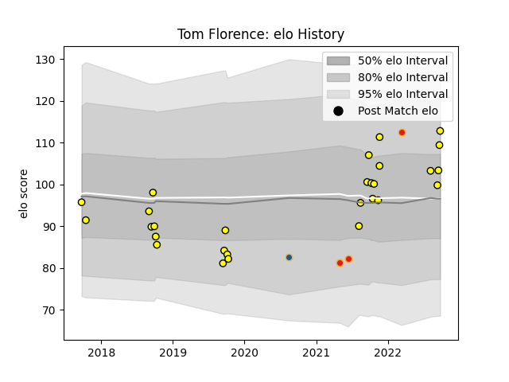

---  
layout: page  
title: Tom Florence  
date: 2023-02-24 02:28:13.723318  
categories: player  
---
# Tom Florence

## Positions: FL

## Current elo: 113.0

## Current Percentile: 78.0

# Elo History

# Match History

| Team        |   Appearances |   Win Rate |
|:------------|--------------:|-----------:|
| Taranaki    |            28 |   0.5      |
| Chiefs      |             3 |   0.666667 |
| Highlanders |             1 |   1        |

| Opponent                 |   Matches |   Win Rate |
|:-------------------------|----------:|-----------:|
| North Harbour            |         3 |   0        |
| Otago                    |         3 |   1        |
| Hawke's Bay              |         3 |   0.666667 |
| Northland                |         3 |   0.333333 |
| Auckland                 |         2 |   0        |
| Waikato                  |         2 |   0.5      |
| Tasman                   |         2 |   0        |
| Southland                |         2 |   1        |
| Manawatu                 |         2 |   1        |
| Bay of Plenty            |         2 |   0.5      |
| Wellington               |         2 |   0.5      |
| New South Wales Waratahs |         1 |   1        |
| Hurricanes               |         1 |   1        |
| Crusaders                |         1 |   1        |
| Counties Manukau         |         1 |   1        |
| Canterbury               |         1 |   0        |
| Blues                    |         1 |   0        |