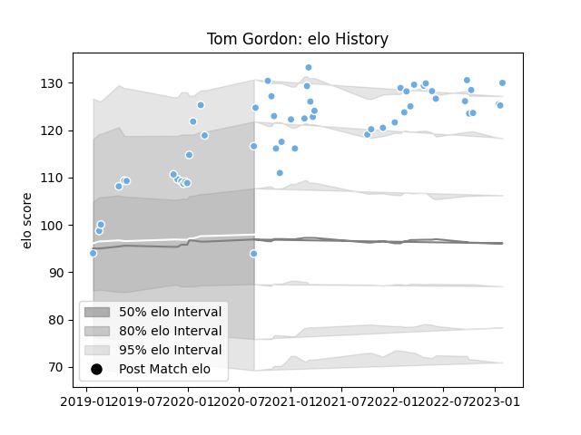

---  
layout: page  
title: Tom Gordon  
date: 2023-01-15 11:45:22.605049  
categories: player  
---
# Tom Gordon

## Positions: FL

## Current elo: 94.0

## Current Percentile: 88.0

# Elo History

# Match History

| Team             |   Appearances |   Win Rate |
|:-----------------|--------------:|-----------:|
| Glasgow Warriors |            52 |   0.538462 |

| Opponent         |   Matches |   Win Rate |
|:-----------------|----------:|-----------:|
| Edinburgh        |        10 |   0.5      |
| Benetton Treviso |         5 |   0.6      |
| Ospreys          |         5 |   0.6      |
| Leinster         |         5 |   0        |
| Zebre            |         4 |   1        |
| Cardiff Blues    |         3 |   1        |
| Ulster           |         3 |   0.333333 |
| La Rochelle      |         2 |   0.5      |
| Connacht         |         2 |   1        |
| Bulls            |         2 |   0.5      |
| Scarlets         |         2 |   0.5      |
| Sharks           |         2 |   0.5      |
| Munster          |         2 |   0.5      |
| Dragons          |         1 |   0        |
| Exeter Chiefs    |         1 |   0        |
| Perpignan        |         1 |   1        |
| Sale Sharks      |         1 |   1        |
| Stormers         |         1 |   0        |