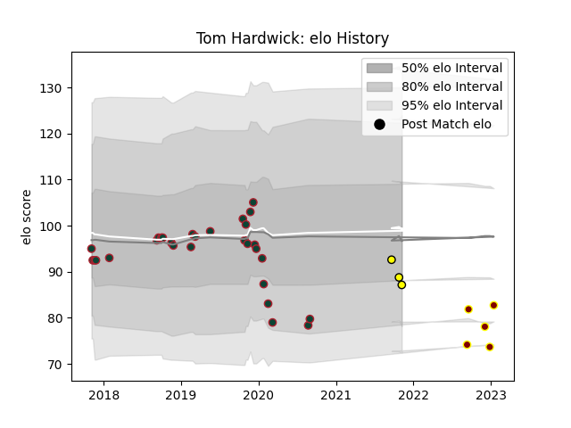

---  
layout: page  
title: Tom Hardwick  
date: 2023-02-02 19:01:55.511206  
categories: player  
---
# Tom Hardwick

## Positions: FH, C

## Current elo: 87.0

## Current Percentile: None

# Elo History

# Match History

| Team             |   Appearances |   Win Rate |
|:-----------------|--------------:|-----------:|
| Leicester Tigers |            29 |   0.37931  |
| Ampthill         |             6 |   0.166667 |
| Albi             |             3 |   0.333333 |

| Opponent                   |   Matches |   Win Rate |
|:---------------------------|----------:|-----------:|
| Bath Rugby                 |         4 |   0        |
| Gloucester Rugby           |         4 |   0.5      |
| Saracens                   |         4 |   0        |
| Sale Sharks                |         3 |   0.666667 |
| Worcester Warriors         |         3 |   0        |
| Ealing Trailfinders        |         2 |   0        |
| Cardiff Blues              |         2 |   1        |
| Calvisano                  |         2 |   1        |
| Wasps                      |         2 |   0.5      |
| Exeter Chiefs              |         1 |   0        |
| Hartpury College           |         1 |   0        |
| Jersey                     |         1 |   0        |
| London Irish               |         1 |   0        |
| Bedford                    |         1 |   0        |
| Newcastle Falcons          |         1 |   1        |
| Nice                       |         1 |   0        |
| Northampton Saints         |         1 |   1        |
| Pau                        |         1 |   0        |
| Suresnes                   |         1 |   1        |
| Valence Romans Drome Rugby |         1 |   0        |
| London Scottish            |         1 |   1        |