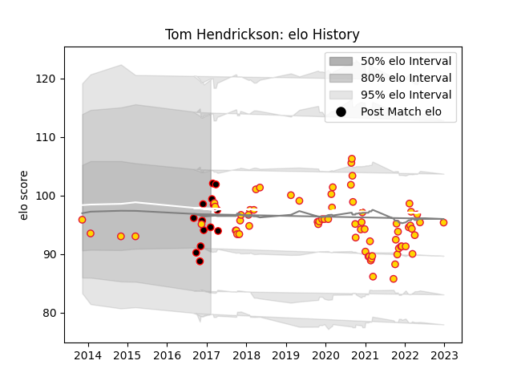

---  
layout: page  
title: Tom Hendrickson  
date: 2023-01-06 00:20:19.349511  
categories: player  
---
# Tom Hendrickson

## Positions: C

## Current elo: 104.0

## Current Percentile: 45.0

# Elo History

# Match History

| Team            |   Appearances |   Win Rate |
|:----------------|--------------:|-----------:|
| Exeter Chiefs   |            72 |   0.680556 |
| Cornish Pirates |            14 |   0.535714 |

| Opponent            |   Matches |   Win Rate |
|:--------------------|----------:|-----------:|
| Bath Rugby          |         8 |   0.875    |
| Harlequins          |         8 |   0.75     |
| Gloucester Rugby    |         6 |   0.833333 |
| Wasps               |         6 |   0.5      |
| Sale Sharks         |         6 |   0.666667 |
| Leicester Tigers    |         6 |   0.5      |
| Worcester Warriors  |         6 |   0.666667 |
| Newcastle Falcons   |         5 |   0.8      |
| Northampton Saints  |         5 |   0.8      |
| Saracens            |         5 |   0.4      |
| London Irish        |         4 |   0.25     |
| Glasgow Warriors    |         2 |   0.5      |
| Doncaster           |         2 |   1        |
| Jersey              |         2 |   0        |
| Bristol Rugby       |         2 |   0.5      |
| Bedford             |         2 |   0.75     |
| Richmond            |         2 |   0        |
| Rotherham Titans    |         2 |   0.5      |
| Scarlets            |         1 |   1        |
| London Welsh        |         1 |   1        |
| Ospreys             |         1 |   1        |
| Montpellier Herault |         1 |   1        |
| London Scottish     |         1 |   1        |
| Cardiff Blues       |         1 |   1        |
| Yorkshire Carnegie  |         1 |   1        |