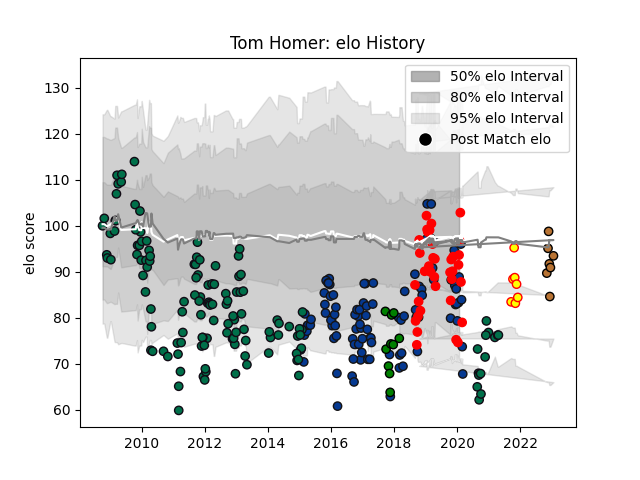

---  
layout: page  
title: Tom Homer  
date: 2022-12-09 13:20:43.044130  
categories: player  
---
# Tom Homer

## Positions: FB, SH

## Current elo: 93.0

## Current Percentile: 38.0

# Elo History

# Match History

| Team               |   Appearances |   Win Rate |
|:-------------------|--------------:|-----------:|
| London Irish       |           133 |   0.402256 |
| Bath Rugby         |           100 |   0.5      |
| Jersey             |            25 |   0.4      |
| Yorkshire Carnegie |            10 |   0.65     |
| Richmond           |             7 |   0.285714 |
| Narbonne           |             4 |   0.875    |

| Opponent                   |   Matches |   Win Rate |
|:---------------------------|----------:|-----------:|
| Harlequins                 |        20 |   0.4      |
| Gloucester Rugby           |        20 |   0.375    |
| Wasps                      |        18 |   0.305556 |
| Worcester Warriors         |        18 |   0.694444 |
| Exeter Chiefs              |        17 |   0.411765 |
| Leicester Tigers           |        17 |   0.323529 |
| Saracens                   |        15 |   0.333333 |
| Northampton Saints         |        15 |   0.333333 |
| Sale Sharks                |        14 |   0.678571 |
| Newcastle Falcons          |        14 |   0.464286 |
| Bristol Rugby              |        12 |   0.5      |
| Cardiff Blues              |         8 |   0.375    |
| London Irish               |         7 |   0.857143 |
| Bath Rugby                 |         7 |   0.214286 |
| Bedford                    |         6 |   0.5      |
| Scarlets                   |         5 |   0        |
| Doncaster                  |         5 |   0.6      |
| Hartpury College           |         4 |   0.375    |
| London Welsh               |         4 |   0.75     |
| Leinster                   |         4 |   0.5      |
| Yorkshire Carnegie         |         4 |   0.5      |
| Ealing Trailfinders        |         4 |   0        |
| Cornish Pirates            |         4 |   0.75     |
| Nottingham                 |         3 |   0.666667 |
| Brive                      |         3 |   1        |
| London Scottish            |         3 |   0.333333 |
| Pau                        |         3 |   1        |
| Jersey                     |         2 |   0.5      |
| Stade Toulousain           |         2 |   0        |
| Clermont Auvergne          |         2 |   0        |
| Leeds                      |         2 |   0        |
| Racing 92                  |         2 |   0.5      |
| Coventry                   |         2 |   0        |
| Cognac Saint Jean d'Angély |         1 |   1        |
| Lusitanos XV               |         1 |   1        |
| Rennes                     |         1 |   1        |
| Rotherham Titans           |         1 |   1        |
| Rovigo                     |         1 |   1        |
| Cavalieri Prato            |         1 |   1        |
| Carqueiranne-Hyères        |         1 |   1        |
| Edinburgh                  |         1 |   0        |
| Toulon                     |         1 |   0        |
| Ulster                     |         1 |   0        |
| Grenoble                   |         1 |   1        |
| Blagnac                    |         1 |   0.5      |
| Ampthill                   |         1 |   0        |