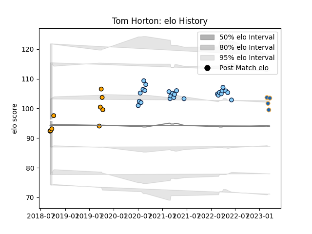

---  
layout: page  
title: Tom Horton  
date: 2023-03-21 18:16:58.017082  
categories: player  
---
# Tom Horton

Last updated: 2023-03-21
## Positions: H

## Current elo: 93.0

## Current Percentile: 44.0

# Elo History

# Match History

| Team                     |   Appearances |   Win Rate |
|:-------------------------|--------------:|-----------:|
| New South Wales Waratahs |            25 |   0.32     |
| NSW Country Eagles       |             9 |   0.166667 |
| Western Force            |             4 |   0.5      |

| Opponent           |   Matches |   Win Rate |
|:-------------------|----------:|-----------:|
| Queensland Reds    |         7 |   0.142857 |
| Western Force      |         6 |   0.5      |
| Brumbies           |         5 |   0        |
| Melbourne Rebels   |         5 |   0.6      |
| Chiefs             |         3 |   0        |
| Fijian Drua        |         3 |   0.833333 |
| Brisbane City      |         2 |   0        |
| Canberra Vikings   |         2 |   0        |
| Moana Pasifika     |         2 |   1        |
| Highlanders        |         1 |   0        |
| Melbourne Rising   |         1 |   0        |
| Queensland Country |         1 |   0        |