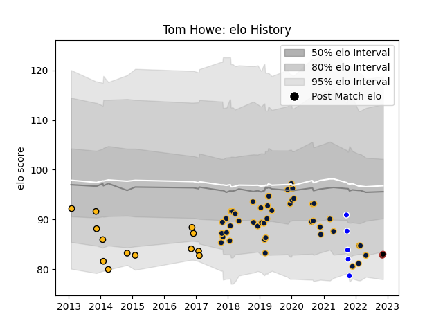

---  
layout: page  
title: Tom Howe  
date: 2022-11-22 11:28:35.884496  
categories: player  
---
# Tom Howe

## Positions: W

## Current elo: 82.0

## Current Percentile: 8.0

# Elo History

# Match History

| Team               |   Appearances |   Win Rate |
|:-------------------|--------------:|-----------:|
| Worcester Warriors |            46 |   0.402174 |
| Wasps              |            13 |   0.230769 |
| Coventry           |             5 |   0.4      |
| Saracens           |             2 |   1        |

| Opponent             |   Matches |   Win Rate |
|:---------------------|----------:|-----------:|
| Sale Sharks          |         8 |   0.25     |
| London Irish         |         6 |   0.666667 |
| Saracens             |         5 |   0.2      |
| Harlequins           |         5 |   0.2      |
| Exeter Chiefs        |         4 |   0.5      |
| Bristol Rugby        |         4 |   0.5      |
| Leicester Tigers     |         3 |   0.333333 |
| Ospreys              |         3 |   0.666667 |
| Dragons              |         3 |   0        |
| Northampton Saints   |         2 |   0.5      |
| Newcastle Falcons    |         2 |   0.25     |
| Gloucester Rugby     |         2 |   0        |
| RC Enisei            |         2 |   1        |
| Stade Francais Paris |         2 |   1        |
| Wasps                |         2 |   0        |
| Brive                |         2 |   0.5      |
| Oyonnax              |         2 |   0.5      |
| Richmond             |         1 |   1        |
| Ampthill             |         1 |   0        |
| Pau                  |         1 |   0        |
| Hartpury College     |         1 |   0        |
| Ealing Trailfinders  |         1 |   0        |
| Doncaster            |         1 |   1        |
| Connacht             |         1 |   0        |
| Cardiff Blues        |         1 |   0        |
| Worcester Warriors   |         1 |   1        |