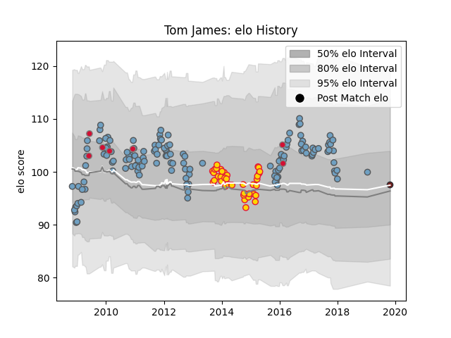

---  
layout: page  
title: Tom James  
date: 2023-03-17 17:33:51.867157  
categories: player  
---
# Tom James

## Positions: W

## Country: Wales

## Current elo: 93.0

## Current Percentile: 66.0

# Elo History

# Match History

| Team          |   Appearances |   Win Rate |
|:--------------|--------------:|-----------:|
| Cardiff Blues |           146 |   0.537671 |
| Exeter Chiefs |            39 |   0.564103 |
| Wales         |            10 |   0.55     |
| Scarlets      |             2 |   0.5      |

| Opponent                 |   Matches |   Win Rate |
|:-------------------------|----------:|-----------:|
| Glasgow Warriors         |        13 |  0.384615  |
| Leinster                 |        12 |  0.0833333 |
| Connacht                 |        11 |  0.818182  |
| Dragons                  |        11 |  0.818182  |
| Edinburgh                |        11 |  0.636364  |
| Ulster                   |        10 |  0.4       |
| Harlequins               |        10 |  0.45      |
| Ospreys                  |         9 |  0.388889  |
| Scarlets                 |         8 |  0.25      |
| Gloucester Rugby         |         8 |  0.5       |
| Munster                  |         7 |  0.285714  |
| Benetton Treviso         |         6 |  1         |
| Northampton Saints       |         6 |  0.333333  |
| Leicester Tigers         |         6 |  0.333333  |
| Newcastle Falcons        |         5 |  0.6       |
| Zebre                    |         5 |  0.8       |
| Bath Rugby               |         5 |  0.6       |
| London Irish             |         4 |  1         |
| Sale Sharks              |         4 |  0.5       |
| Wasps                    |         4 |  0.5       |
| Stade Toulousain         |         3 |  0.666667  |
| Aironi                   |         3 |  1         |
| Calvisano                |         2 |  1         |
| La Rochelle              |         2 |  1         |
| Bristol Rugby            |         2 |  1         |
| Toulon                   |         2 |  0         |
| Worcester Warriors       |         2 |  1         |
| Biarritz Olympique       |         2 |  1         |
| Stade Francais Paris     |         2 |  0.5       |
| Racing 92                |         2 |  1         |
| Castres Olympique        |         2 |  0.5       |
| Saracens                 |         2 |  0         |
| Montpellier Herault      |         2 |  0.5       |
| United States of America |         1 |  1         |
| Australia                |         1 |  0         |
| Scotland                 |         1 |  1         |
| South Africa             |         1 |  0         |
| Exeter Chiefs            |         1 |  0.5       |
| Samoa                    |         1 |  1         |
| England                  |         1 |  0         |
| Bourgoin-Jallieu         |         1 |  1         |
| New Zealand              |         1 |  0         |
| London Welsh             |         1 |  1         |
| Argentina                |         1 |  1         |
| Ireland                  |         1 |  0.5       |
| Canada                   |         1 |  1         |
| Bayonne                  |         1 |  0         |