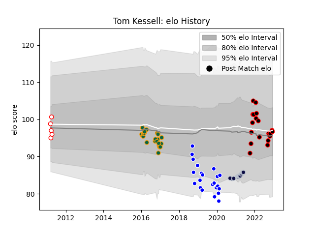

---  
layout: page  
title: Tom Kessell  
date: 2023-01-13 11:25:08.364239  
categories: player  
---
# Tom Kessell

## Positions: SH

## Current elo: 102.0

## Current Percentile: 53.0

# Elo History

# Match History

| Team               |   Appearances |   Win Rate |
|:-------------------|--------------:|-----------:|
| Cornish Pirates    |            26 |   0.653846 |
| Northampton Saints |            25 |   0.52     |
| Coventry           |            22 |   0.409091 |
| Bristol Rugby      |            17 |   0.676471 |
| Plymouth           |             6 |   0.5      |

| Opponent            |   Matches |   Win Rate |
|:--------------------|----------:|-----------:|
| Ealing Trailfinders |         6 |   0.25     |
| Leicester Tigers    |         5 |   0.2      |
| Wasps               |         5 |   0.2      |
| Nottingham          |         5 |   0.9      |
| Newcastle Falcons   |         5 |   0.4      |
| Gloucester Rugby    |         5 |   1        |
| Ampthill            |         4 |   0.625    |
| Bedford             |         4 |   0.75     |
| Doncaster           |         4 |   0.75     |
| London Irish        |         4 |   0.375    |
| Jersey              |         4 |   0.25     |
| Worcester Warriors  |         3 |   1        |
| Sale Sharks         |         3 |   0.333333 |
| Richmond            |         3 |   0.5      |
| London Scottish     |         3 |   0.666667 |
| Yorkshire Carnegie  |         3 |   0.666667 |
| Coventry            |         3 |   0.666667 |
| Hartpury College    |         3 |   0.666667 |
| Bath Rugby          |         2 |   1        |
| Exeter Chiefs       |         2 |   0.5      |
| Cornish Pirates     |         2 |   0.5      |
| Saracens            |         2 |   0.5      |
| Esher               |         2 |   0        |
| Pertemps Bees       |         2 |   1        |
| Moseley             |         2 |   0.5      |
| Harlequins          |         2 |   1        |
| Leinster            |         2 |   0        |
| Northampton Saints  |         1 |   1        |
| Glasgow Warriors    |         1 |   1        |
| Montpellier Herault |         1 |   0        |
| Scarlets            |         1 |   1        |
| Toulon              |         1 |   1        |
| Caldy               |         1 |   0        |