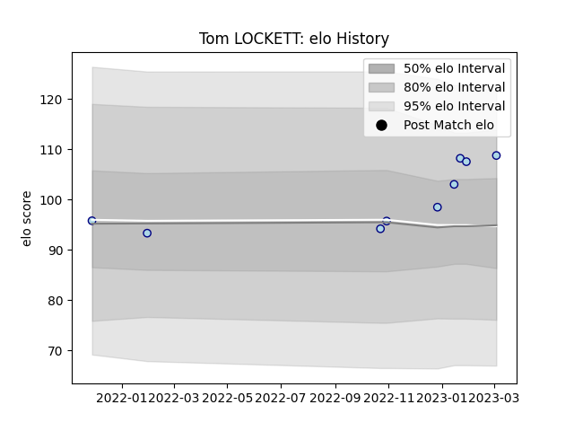

---  
layout: page  
title: Tom LOCKETT  
date: 2023-02-06 11:15:31.171691  
categories: player  
---
# Tom LOCKETT

## Positions: L

## Current elo: 106.0

## Current Percentile: 74.0

# Elo History

# Match History

| Team    |   Appearances |   Win Rate |
|:--------|--------------:|-----------:|
| Bedford |             8 |      0.625 |

| Opponent         |   Matches |   Win Rate |
|:-----------------|----------:|-----------:|
| Hartpury College |         2 |        0.5 |
| Ampthill         |         1 |        1   |
| Caldy            |         1 |        0   |
| Cornish Pirates  |         1 |        1   |
| London Scottish  |         1 |        1   |
| Nottingham       |         1 |        1   |
| Richmond         |         1 |        0   |