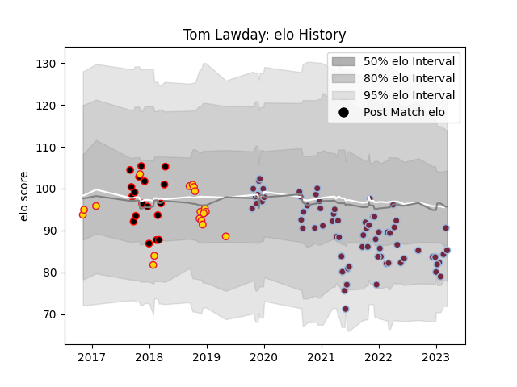

---  
layout: page  
title: Tom Lawday  
date: 2023-03-17 17:14:13.869094  
categories: player  
---
# Tom Lawday

## Positions: FL, N8

## Current elo: 86.0

## Current Percentile: 35.0

# Elo History

# Match History

| Team            |   Appearances |   Win Rate |
|:----------------|--------------:|-----------:|
| Harlequins      |            70 |   0.557143 |
| Cornish Pirates |            18 |   0.5      |
| Exeter Chiefs   |            18 |   0.583333 |

| Opponent            |   Matches |   Win Rate |
|:--------------------|----------:|-----------:|
| Bristol Rugby       |        11 |   0.454545 |
| Gloucester Rugby    |         9 |   0.777778 |
| Worcester Warriors  |         6 |   0.5      |
| Exeter Chiefs       |         6 |   0.5      |
| Saracens            |         6 |   0.333333 |
| Sale Sharks         |         6 |   0.333333 |
| London Irish        |         6 |   0.583333 |
| Northampton Saints  |         6 |   0.5      |
| Bath Rugby          |         5 |   0.8      |
| Wasps               |         5 |   1        |
| Leicester Tigers    |         5 |   0.5      |
| Newcastle Falcons   |         4 |   1        |
| Cardiff Blues       |         3 |   1        |
| Ulster              |         2 |   0        |
| Sharks              |         2 |   0.5      |
| Nottingham          |         2 |   0        |
| Yorkshire Carnegie  |         2 |   0.5      |
| Bedford             |         2 |   1        |
| Jersey              |         2 |   0        |
| Hartpury College    |         2 |   1        |
| Harlequins          |         2 |   0        |
| Doncaster           |         2 |   1        |
| Castres Olympique   |         2 |   0.5      |
| Munster             |         1 |   0.5      |
| Montpellier Herault |         1 |   0        |
| Racing 92           |         1 |   0        |
| Richmond            |         1 |   1        |
| Rotherham Titans    |         1 |   1        |
| Ealing Trailfinders |         1 |   0        |
| Clermont Auvergne   |         1 |   0        |
| London Scottish     |         1 |   0        |