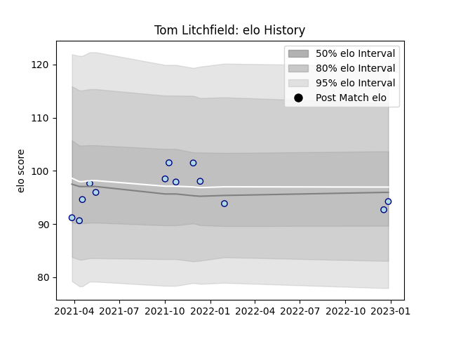

---  
layout: page  
title: Tom Litchfield  
date: 2023-02-02 18:57:04.904004  
categories: player  
---
# Tom Litchfield

## Positions: C

## Current elo: 102.0

## Current Percentile: 38.0

# Elo History

# Match History

| Team    |   Appearances |   Win Rate |
|:--------|--------------:|-----------:|
| Bedford |            15 |   0.533333 |

| Opponent            |   Matches |   Win Rate |
|:--------------------|----------:|-----------:|
| Ampthill            |         2 |        1   |
| Doncaster           |         2 |        0.5 |
| Jersey              |         2 |        0   |
| London Scottish     |         2 |        1   |
| Richmond            |         2 |        0.5 |
| Cornish Pirates     |         1 |        1   |
| Ealing Trailfinders |         1 |        0   |
| Hartpury College    |         1 |        0   |
| Nottingham          |         1 |        1   |
| Saracens            |         1 |        0   |