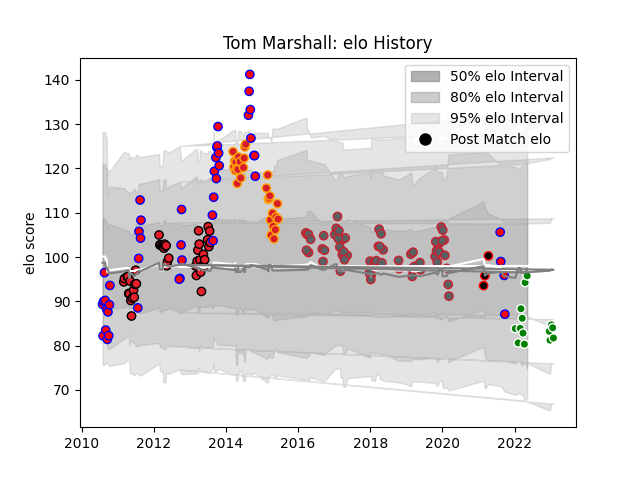

---  
layout: page  
title: Tom Marshall  
date: 2022-12-18 16:30:24.915245  
categories: player  
---
# Tom Marshall

## Positions: FB, W

## Current elo: 84.0

## Current Percentile: 19.0

# Elo History

# Match History

| Team                            |   Appearances |   Win Rate |
|:--------------------------------|--------------:|-----------:|
| Gloucester Rugby                |            60 |   0.433333 |
| Crusaders                       |            46 |   0.695652 |
| Tasman                          |            45 |   0.566667 |
| Chiefs                          |            29 |   0.551724 |
| Green Rockets Tokatsu           |             7 |   0        |
| NTT Docomo Red Hurricanes Osaka |             3 |   0.666667 |

| Opponent                        |   Matches |   Win Rate |
|:--------------------------------|----------:|-----------:|
| Blues                           |         9 |   0.888889 |
| Hurricanes                      |         8 |   0.5      |
| Highlanders                     |         7 |   0.428571 |
| Sale Sharks                     |         6 |   0.666667 |
| Chiefs                          |         6 |   0.5      |
| Stormers                        |         6 |   1        |
| Leicester Tigers                |         5 |   0.2      |
| Queensland Reds                 |         5 |   0.6      |
| Hawke's Bay                     |         5 |   1        |
| Wasps                           |         5 |   0.4      |
| Counties Manukau                |         5 |   0.4      |
| Bulls                           |         5 |   0.7      |
| Melbourne Rebels                |         4 |   0.5      |
| Saracens                        |         4 |   0.5      |
| New South Wales Waratahs        |         4 |   0.75     |
| Newcastle Falcons               |         4 |   0.25     |
| Exeter Chiefs                   |         4 |   0.5      |
| Otago                           |         4 |   0.25     |
| Cheetahs                        |         4 |   0.625    |
| Waikato                         |         4 |   0.5      |
| Canterbury                      |         4 |   0.5      |
| Bath Rugby                      |         4 |   0.375    |
| Brumbies                        |         4 |   0.5      |
| Bay of Plenty                   |         4 |   1        |
| Taranaki                        |         4 |   0.25     |
| Worcester Warriors              |         4 |   0.625    |
| Western Force                   |         4 |   0.5      |
| Crusaders                       |         3 |   0.666667 |
| Sharks                          |         3 |   0.333333 |
| Northland                       |         3 |   1        |
| Northampton Saints              |         3 |   0        |
| Auckland                        |         3 |   0.833333 |
| Bristol Rugby                   |         3 |   0.333333 |
| Manawatu                        |         3 |   0.333333 |
| Southland                       |         3 |   0.666667 |
| Kobelco Kobe Steelers           |         3 |   0        |
| Harlequins                      |         3 |   0.333333 |
| Stade Toulousain                |         2 |   0        |
| London Irish                    |         2 |   0.5      |
| Yokohama Canon Eagles           |         2 |   0.5      |
| North Harbour                   |         2 |   0        |
| Connacht                        |         2 |   1        |
| Black Rams Tokyo                |         2 |   0.5      |
| Lions                           |         2 |   1        |
| Cardiff Blues                   |         2 |   0.5      |
| Bayonne                         |         1 |   1        |
| Wellington                      |         1 |   0        |
| Castres Olympique               |         1 |   1        |
| Toyota Verblitz                 |         1 |   0        |
| Dragons                         |         1 |   0        |
| NTT Docomo Red Hurricanes Osaka |         1 |   0        |
| La Rochelle                     |         1 |   1        |
| Stade Francais Paris            |         1 |   0        |
| Southern Kings                  |         1 |   1        |
| Shizuoka Blue Revs              |         1 |   0        |
| Munster                         |         1 |   0        |
| Agen                            |         1 |   1        |