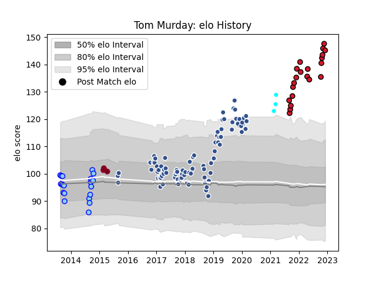

---  
layout: page  
title: Tom Murday  
date: 2023-01-17 11:38:26.895891  
categories: player  
---
# Tom Murday

## Positions: L

## Current elo: 104.0

## Current Percentile: 96.0

# Elo History

# Match History

| Team                             |   Appearances |   Win Rate |
|:---------------------------------|--------------:|-----------:|
| Agen                             |            92 |   0.461957 |
| Oyonnax                          |            30 |   0.833333 |
| Northland                        |            21 |   0.357143 |
| Queensland Reds                  |             4 |   0.25     |
| Toyota Industries Shuttles Aichi |             3 |   1        |

| Opponent                 |   Matches |   Win Rate |
|:-------------------------|----------:|-----------:|
| Stade Toulousain         |         6 |   0        |
| Clermont Auvergne        |         6 |   0.166667 |
| Montpellier Herault      |         5 |   0.4      |
| Grenoble                 |         5 |   0.7      |
| Castres Olympique        |         5 |   0.4      |
| Bordeaux Begles          |         5 |   0.2      |
| Carcassonne              |         5 |   1        |
| Perpignan                |         4 |   0.75     |
| Lyon                     |         4 |   0.25     |
| Colomiers                |         4 |   0.375    |
| Oyonnax                  |         4 |   0.25     |
| Pau                      |         4 |   0.25     |
| La Rochelle              |         4 |   0.25     |
| Racing 92                |         4 |   0.625    |
| Beziers                  |         4 |   0.625    |
| Stade Francais Paris     |         4 |   0.75     |
| Aurillac                 |         4 |   0.5      |
| Provence Rugby           |         3 |   0.5      |
| Soyaux-Angouleme         |         3 |   1        |
| Toulon                   |         3 |   0.666667 |
| Nevers                   |         3 |   0.666667 |
| Narbonne                 |         3 |   0.666667 |
| Vannes                   |         3 |   1        |
| Montauban                |         3 |   1        |
| Agen                     |         3 |   1        |
| Mont-de-Marsan           |         3 |   1        |
| Hawke's Bay              |         3 |   0.333333 |
| Brive                    |         3 |   1        |
| Bayonne                  |         3 |   0.666667 |
| Manawatu                 |         2 |   0        |
| Otago                    |         2 |   0.5      |
| Southland                |         2 |   0.5      |
| Bourgoin-Jallieu         |         2 |   1        |
| Bay of Plenty            |         2 |   1        |
| Auckland                 |         2 |   0        |
| North Harbour            |         2 |   0.75     |
| Dax                      |         2 |   1        |
| Wasps                    |         2 |   0        |
| Wellington               |         2 |   0.5      |
| Biarritz Olympique       |         2 |   0.5      |
| US Bressane              |         1 |   1        |
| Waikato                  |         1 |   0        |
| Tasman                   |         1 |   0        |
| Taranaki                 |         1 |   0        |
| Rouen                    |         1 |   1        |
| Benetton Treviso         |         1 |   0        |
| Skyactivs Hiroshima      |         1 |   1        |
| Albi                     |         1 |   0        |
| Bulls                    |         1 |   0        |
| Canterbury               |         1 |   0        |
| Coca-Cola Red Sparks     |         1 |   1        |
| New South Wales Waratahs |         1 |   0        |
| Highlanders              |         1 |   0        |
| Kyuden Voltex            |         1 |   1        |
| Western Force            |         1 |   1        |