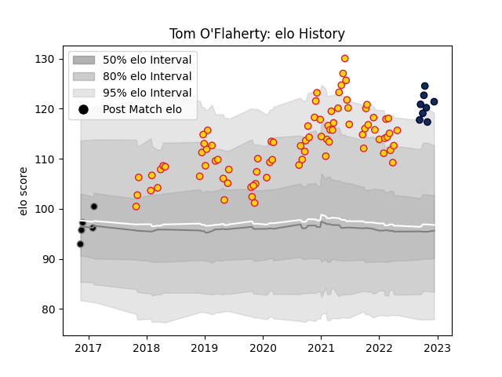

---  
layout: page  
title: Tom O'Flaherty  
date: 2023-02-02 19:09:44.895550  
categories: player  
---
# Tom O'Flaherty

## Positions: W

## Current elo: 121.0

## Current Percentile: 92.0

# Elo History

# Match History

| Team          |   Appearances |   Win Rate |
|:--------------|--------------:|-----------:|
| Exeter Chiefs |            83 |   0.722892 |
| Sale Sharks   |            15 |   0.6      |
| Ospreys       |             5 |   0.8      |

| Opponent           |   Matches |   Win Rate |
|:-------------------|----------:|-----------:|
| Bath Rugby         |        11 |   0.909091 |
| Northampton Saints |        11 |   0.727273 |
| Harlequins         |        10 |   0.5      |
| Sale Sharks        |         8 |   0.75     |
| Saracens           |         7 |   0.428571 |
| Leicester Tigers   |         7 |   0.714286 |
| Worcester Warriors |         7 |   0.714286 |
| London Irish       |         6 |   0.666667 |
| Bristol Rugby      |         6 |   0.833333 |
| Wasps              |         6 |   0.666667 |
| Gloucester Rugby   |         5 |   0.8      |
| Newcastle Falcons  |         5 |   0.8      |
| Stade Toulousain   |         3 |   0.333333 |
| Glasgow Warriors   |         2 |   1        |
| Ulster             |         2 |   0.5      |
| La Rochelle        |         1 |   1        |
| Exeter Chiefs      |         1 |   1        |
| Racing 92          |         1 |   1        |
| Castres Olympique  |         1 |   1        |
| Cardiff Blues      |         1 |   1        |
| Scarlets           |         1 |   1        |
| Munster            |         1 |   0        |