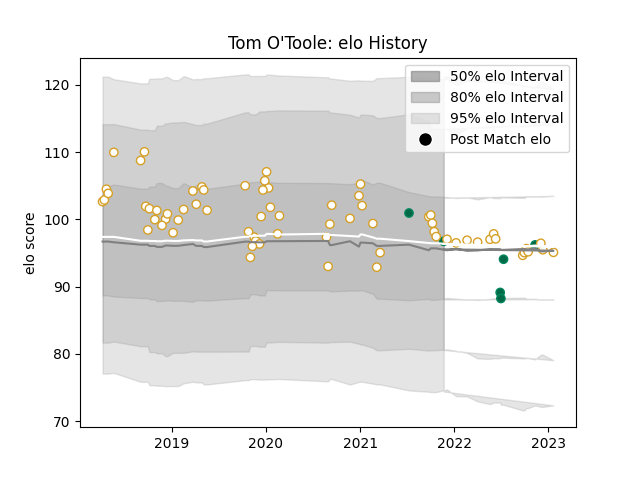

---  
layout: page  
title: Tom O'Toole  
date: 2023-01-23 15:34:35.209566  
categories: player  
---
# Tom O'Toole

## Positions: P

## Country: Ireland

## Current elo: 97.0

## Current Percentile: 56.0

# Elo History

# Match History

| Team    |   Appearances |   Win Rate |
|:--------|--------------:|-----------:|
| Ulster  |            68 |   0.639706 |
| Ireland |             6 |   0.666667 |

| Opponent                 |   Matches |   Win Rate |
|:-------------------------|----------:|-----------:|
| Leinster                 |         9 |   0.111111 |
| Munster                  |         7 |   0.5      |
| Connacht                 |         6 |   0.5      |
| Scarlets                 |         6 |   0.833333 |
| Ospreys                  |         6 |   0.666667 |
| Glasgow Warriors         |         5 |   0.6      |
| Southern Kings           |         3 |   1        |
| Zebre                    |         3 |   1        |
| Benetton Treviso         |         3 |   0.833333 |
| Dragons                  |         2 |   1        |
| Lions                    |         2 |   1        |
| Sale Sharks              |         2 |   0.5      |
| Edinburgh                |         2 |   1        |
| Cheetahs                 |         2 |   0.75     |
| New Zealand Maori        |         2 |   0.5      |
| Bath Rugby               |         2 |   1        |
| Harlequins               |         2 |   1        |
| Clermont Auvergne        |         2 |   0.5      |
| New Zealand              |         1 |   0        |
| Cardiff Blues            |         1 |   1        |
| Bulls                    |         1 |   0        |
| Sharks                   |         1 |   1        |
| Fiji                     |         1 |   1        |
| Stormers                 |         1 |   0        |
| United States of America |         1 |   1        |
| Argentina                |         1 |   1        |