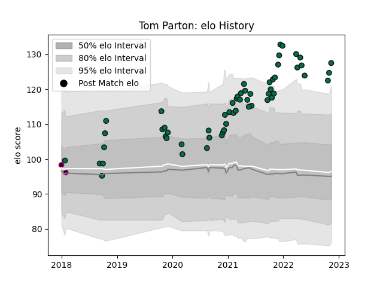

---  
layout: page  
title: Tom Parton  
date: 2022-11-15 23:42:44.957493  
categories: player  
---
# Tom Parton

## Positions: FB

## Current elo: 128.0

## Current Percentile: 97.0

# Elo History

# Match History

| Team            |   Appearances |   Win Rate |
|:----------------|--------------:|-----------:|
| London Irish    |            57 |   0.447368 |
| London Scottish |             2 |   0.5      |

| Opponent            |   Matches |   Win Rate |
|:--------------------|----------:|-----------:|
| Wasps               |         6 |   0.416667 |
| Leicester Tigers    |         5 |   0.4      |
| Sale Sharks         |         5 |   0.1      |
| Harlequins          |         5 |   0.3      |
| Gloucester Rugby    |         4 |   0.375    |
| Newcastle Falcons   |         4 |   0.75     |
| Northampton Saints  |         3 |   0        |
| Bristol Rugby       |         3 |   0.333333 |
| Exeter Chiefs       |         3 |   0.333333 |
| Bath Rugby          |         3 |   0.333333 |
| Worcester Warriors  |         2 |   0        |
| Saracens            |         2 |   0.25     |
| Pau                 |         2 |   1        |
| Nottingham          |         2 |   1        |
| Scarlets            |         1 |   0        |
| Agen                |         1 |   1        |
| London Scottish     |         1 |   1        |
| Krasny Yar          |         1 |   1        |
| Ealing Trailfinders |         1 |   0        |
| Doncaster           |         1 |   1        |
| Coventry            |         1 |   1        |
| Bedford             |         1 |   1        |
| Bayonne             |         1 |   1        |
| Yorkshire Carnegie  |         1 |   1        |