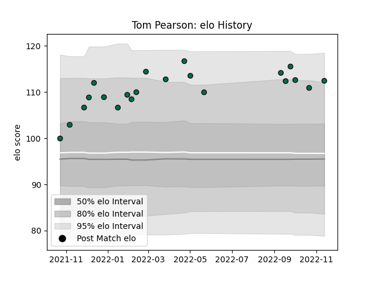

---  
layout: page  
title: Tom Pearson  
date: 2023-01-06 00:22:09.582214  
categories: player  
---
# Tom Pearson

## Positions: FL

## Current elo: 129.0

## Current Percentile: 94.0

# Elo History

# Match History

| Team         |   Appearances |   Win Rate |
|:-------------|--------------:|-----------:|
| London Irish |            25 |        0.5 |

| Opponent           |   Matches |   Win Rate |
|:-------------------|----------:|-----------:|
| Exeter Chiefs      |         3 |   0.666667 |
| Gloucester Rugby   |         3 |   0        |
| Bath Rugby         |         2 |   0.5      |
| Bristol Rugby      |         2 |   0.5      |
| Newcastle Falcons  |         2 |   1        |
| Northampton Saints |         2 |   0        |
| Saracens           |         2 |   0.75     |
| Wasps              |         2 |   0.25     |
| Edinburgh          |         1 |   1        |
| Harlequins         |         1 |   1        |
| Leicester Tigers   |         1 |   0        |
| Pau                |         1 |   1        |
| Sale Sharks        |         1 |   0.5      |
| Stormers           |         1 |   0        |
| Worcester Warriors |         1 |   1        |