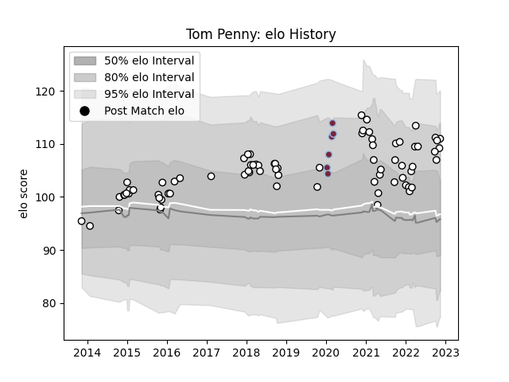

---  
layout: page  
title: Tom Penny  
date: 2023-01-06 00:20:59.486244  
categories: player  
---
# Tom Penny

## Positions: C, FB

## Current elo: 131.0

## Current Percentile: 95.0

# Elo History

# Match History

| Team              |   Appearances |   Win Rate |
|:------------------|--------------:|-----------:|
| Newcastle Falcons |            80 |    0.44375 |
| Harlequins        |             6 |    0.5     |

| Opponent             |   Matches |   Win Rate |
|:---------------------|----------:|-----------:|
| Bath Rugby           |        10 |   0.4      |
| Gloucester Rugby     |         8 |   0.5      |
| Exeter Chiefs        |         7 |   0.428571 |
| Saracens             |         7 |   0.142857 |
| Wasps                |         6 |   0.333333 |
| London Irish         |         6 |   0.333333 |
| Worcester Warriors   |         5 |   0.5      |
| RC Enisei            |         4 |   0.75     |
| Bristol Rugby        |         4 |   0.25     |
| Harlequins           |         4 |   0.5      |
| Sale Sharks          |         4 |   0.5      |
| Northampton Saints   |         4 |   0.25     |
| Dragons              |         3 |   0.666667 |
| Stade Francais Paris |         2 |   0.5      |
| Bucuresti            |         2 |   1        |
| Brive                |         2 |   0.5      |
| Toulon               |         1 |   1        |
| Montpellier Herault  |         1 |   1        |
| Connacht             |         1 |   0        |
| London Scottish      |         1 |   1        |
| Bordeaux Begles      |         1 |   1        |
| Jersey               |         1 |   1        |
| Clermont Auvergne    |         1 |   0        |
| Leicester Tigers     |         1 |   0        |