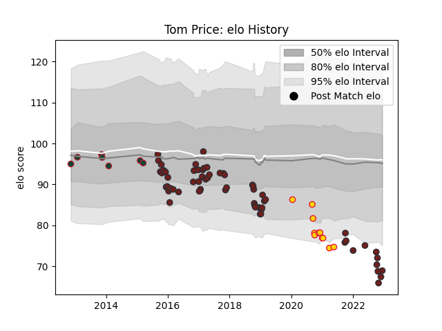

---  
layout: page  
title: Tom Price  
date: 2023-01-15 11:54:59.640677  
categories: player  
---
# Tom Price

## Positions: L

## Current elo: 61.0

## Current Percentile: 1.0

# Elo History

# Match History

| Team             |   Appearances |   Win Rate |
|:-----------------|--------------:|-----------:|
| Scarlets         |            69 |   0.514493 |
| Exeter Chiefs    |            11 |   0.409091 |
| Leicester Tigers |             7 |   0.571429 |

| Opponent           |   Matches |   Win Rate |
|:-------------------|----------:|-----------:|
| Ospreys            |         7 |   0.571429 |
| Benetton Treviso   |         6 |   0.666667 |
| Cardiff Blues      |         6 |   0.5      |
| Leinster           |         6 |   0.333333 |
| Glasgow Warriors   |         6 |   0.583333 |
| Munster            |         5 |   0.6      |
| Zebre              |         4 |   1        |
| Ulster             |         3 |   0.666667 |
| Racing 92          |         3 |   0        |
| Northampton Saints |         3 |   0.333333 |
| Leicester Tigers   |         3 |   0.666667 |
| Wasps              |         3 |   0.333333 |
| Southern Kings     |         3 |   1        |
| Edinburgh          |         3 |   0.333333 |
| Connacht           |         3 |   0.333333 |
| Saracens           |         3 |   0.166667 |
| Exeter Chiefs      |         2 |   0        |
| Toulon             |         2 |   0        |
| London Irish       |         2 |   0.5      |
| Dragons            |         2 |   1        |
| Cheetahs           |         2 |   1        |
| Stormers           |         2 |   0        |
| Worcester Warriors |         1 |   1        |
| Bath Rugby         |         1 |   0        |
| Sale Sharks        |         1 |   0        |
| Bayonne            |         1 |   1        |
| Harlequins         |         1 |   1        |
| Gloucester Rugby   |         1 |   0        |
| Bristol Rugby      |         1 |   0        |
| Lions              |         1 |   1        |