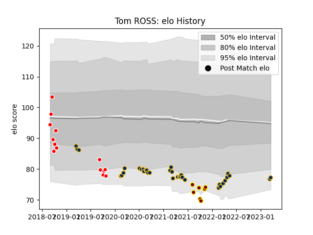

---  
layout: page  
title: Tom ROSS  
date: 2023-03-16 11:32:57.023450  
categories: player  
---
# Tom ROSS

## Positions: P

## Current elo: 78.0

## Current Percentile: 6.0

# Elo History

# Match History

| Team             |   Appearances |   Win Rate |
|:-----------------|--------------:|-----------:|
| Brumbies         |            33 |   0.666667 |
| Canberra Vikings |            14 |   0.642857 |
| Southland        |             7 |   0        |

| Opponent                 |   Matches |   Win Rate |
|:-------------------------|----------:|-----------:|
| Western Force            |         7 |   0.857143 |
| Queensland Reds          |         6 |   0.333333 |
| New South Wales Waratahs |         6 |   1        |
| Fijian Drua              |         5 |   0.6      |
| Melbourne Rebels         |         4 |   0.75     |
| Crusaders                |         3 |   0        |
| Highlanders              |         3 |   0.333333 |
| Chiefs                   |         2 |   0.5      |
| Taranaki                 |         2 |   0        |
| Sydney Rays              |         2 |   1        |
| Brisbane City            |         2 |   1        |
| NSW Country Eagles       |         2 |   1        |
| Queensland Country       |         2 |   0        |
| Tasman                   |         1 |   0        |
| Sunwolves                |         1 |   1        |
| Bay of Plenty            |         1 |   0        |
| Otago                    |         1 |   0        |
| Manawatu                 |         1 |   0        |
| Hurricanes               |         1 |   1        |
| Canterbury               |         1 |   0        |
| Melbourne Rising         |         1 |   1        |