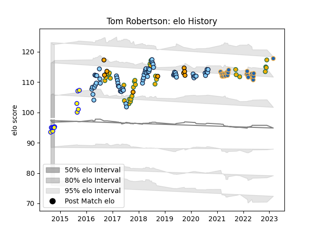

---  
layout: page  
title: Tom Robertson  
date: 2022-11-15 23:40:38.778744  
categories: player  
---
# Tom Robertson

## Positions: P

## Country: Australia

## Current elo: 102.0

## Current Percentile: 71.0

# Elo History

# Match History

| Team                     |   Appearances |   Win Rate |
|:-------------------------|--------------:|-----------:|
| New South Wales Waratahs |            62 |   0.443548 |
| Australia                |            29 |   0.482759 |
| Western Force            |            24 |   0.291667 |
| Sydney Stars             |             4 |   0.625    |

| Opponent                 |   Matches |   Win Rate |
|:-------------------------|----------:|-----------:|
| Brumbies                 |        12 |  0.0833333 |
| Melbourne Rebels         |        12 |  0.666667  |
| Queensland Reds          |         9 |  0.777778  |
| Highlanders              |         7 |  0.285714  |
| New Zealand              |         6 |  0.166667  |
| Crusaders                |         6 |  0         |
| Blues                    |         6 |  0         |
| South Africa             |         5 |  0.6       |
| Chiefs                   |         5 |  0.2       |
| Lions                    |         5 |  0.2       |
| Argentina                |         4 |  1         |
| Jaguares                 |         3 |  0         |
| Sunwolves                |         3 |  1         |
| New South Wales Waratahs |         3 |  0.666667  |
| Western Force            |         3 |  1         |
| Hurricanes               |         3 |  0.333333  |
| England                  |         3 |  0         |
| Ireland                  |         3 |  0.333333  |
| Sharks                   |         2 |  0.25      |
| France                   |         2 |  0.5       |
| Stormers                 |         2 |  1         |
| Bulls                    |         2 |  0.5       |
| Scotland                 |         2 |  0.5       |
| Italy                    |         1 |  0         |
| Wales                    |         1 |  1         |
| Brisbane City            |         1 |  0         |
| Southern Kings           |         1 |  0         |
| Queensland Country       |         1 |  1         |
| Canberra Vikings         |         1 |  0.5       |
| North Harbour Rays       |         1 |  1         |
| Cheetahs                 |         1 |  1         |
| Moana Pasifika           |         1 |  1         |
| Fiji                     |         1 |  1         |
| Japan                    |         1 |  1         |