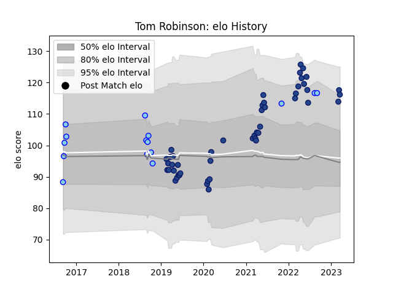

---  
layout: page  
title: Tom Robinson  
date: 2023-03-21 18:00:33.392666  
categories: player  
---
# Tom Robinson

Last updated: 2023-03-21
## Positions: FL, L

## Current elo: 116.0

## Current Percentile: 90.0

# Elo History

# Match History

| Team      |   Appearances |   Win Rate |
|:----------|--------------:|-----------:|
| Blues     |            48 |   0.614583 |
| Northland |            15 |   0.266667 |

| Opponent                 |   Matches |   Win Rate |
|:-------------------------|----------:|-----------:|
| Chiefs                   |         7 |   0.571429 |
| Crusaders                |         7 |   0.142857 |
| Hurricanes               |         7 |   0.714286 |
| Highlanders              |         6 |   0.666667 |
| Brumbies                 |         4 |   0.5      |
| Waikato                  |         4 |   0.25     |
| New South Wales Waratahs |         3 |   1        |
| Queensland Reds          |         3 |   0.666667 |
| Melbourne Rebels         |         2 |   1        |
| Stormers                 |         2 |   1        |
| Southland                |         2 |   0        |
| Auckland                 |         2 |   0.5      |
| Bulls                    |         2 |   0.75     |
| Bay of Plenty            |         1 |   0        |
| North Harbour            |         1 |   0        |
| Otago                    |         1 |   0        |
| Manawatu                 |         1 |   1        |
| Sharks                   |         1 |   0        |
| Jaguares                 |         1 |   0        |
| Fijian Drua              |         1 |   1        |
| Sunwolves                |         1 |   1        |
| Taranaki                 |         1 |   1        |
| Tasman                   |         1 |   0        |
| Wellington               |         1 |   0        |
| Western Force            |         1 |   1        |