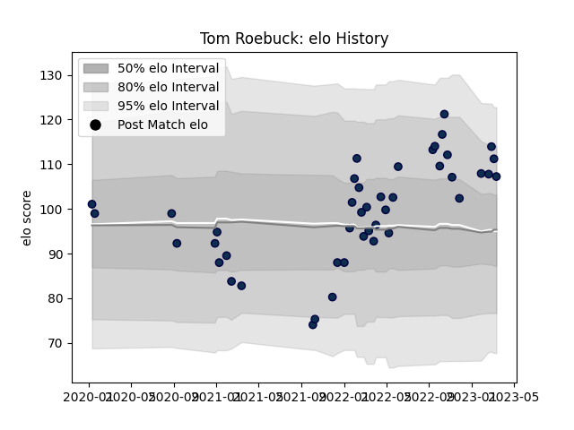

---  
layout: page  
title: Tom Roebuck  
date: 2023-02-02 18:50:17.095921  
categories: player  
---
# Tom Roebuck

## Positions: W

## Current elo: 98.0

## Current Percentile: 63.0

# Elo History

# Match History

| Team        |   Appearances |   Win Rate |
|:------------|--------------:|-----------:|
| Sale Sharks |            35 |   0.657143 |

| Opponent           |   Matches |   Win Rate |
|:-------------------|----------:|-----------:|
| Bath Rugby         |         4 |   0.625    |
| Gloucester Rugby   |         4 |   0.75     |
| Wasps              |         4 |   0.75     |
| Exeter Chiefs      |         3 |   0.333333 |
| Leicester Tigers   |         3 |   1        |
| Northampton Saints |         3 |   0.666667 |
| Saracens           |         3 |   0.333333 |
| Bristol Rugby      |         2 |   1        |
| Harlequins         |         2 |   0.5      |
| London Irish       |         2 |   0.75     |
| Worcester Warriors |         2 |   1        |
| Glasgow Warriors   |         1 |   0        |
| La Rochelle        |         1 |   0        |
| Newcastle Falcons  |         1 |   1        |