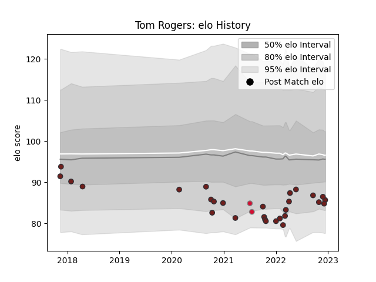

---  
layout: page  
title: Tom Rogers  
date: 2022-12-09 13:14:54.174875  
categories: player  
---
# Tom Rogers

## Positions: W, FB

## Country: Wales

## Current elo: 85.0

## Current Percentile: 15.0

# Elo History

# Match History

| Team     |   Appearances |   Win Rate |
|:---------|--------------:|-----------:|
| Scarlets |            27 |   0.425926 |
| Wales    |             2 |   0.5      |

| Opponent         |   Matches |   Win Rate |
|:-----------------|----------:|-----------:|
| Ospreys          |         3 |   0.833333 |
| Stormers         |         2 |   0        |
| Cardiff Blues    |         2 |   1        |
| Connacht         |         2 |   0.5      |
| Dragons          |         2 |   0.5      |
| Glasgow Warriors |         2 |   0.5      |
| Benetton Treviso |         2 |   1        |
| Leinster         |         2 |   0        |
| Lions            |         2 |   0.5      |
| Munster          |         2 |   0        |
| Argentina        |         1 |   0        |
| Southern Kings   |         1 |   1        |
| Sharks           |         1 |   0        |
| Harlequins       |         1 |   0        |
| Exeter Chiefs    |         1 |   0        |
| Edinburgh        |         1 |   0        |
| Canada           |         1 |   1        |
| Ulster           |         1 |   0        |